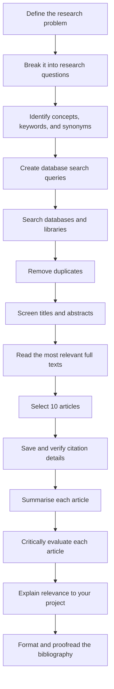
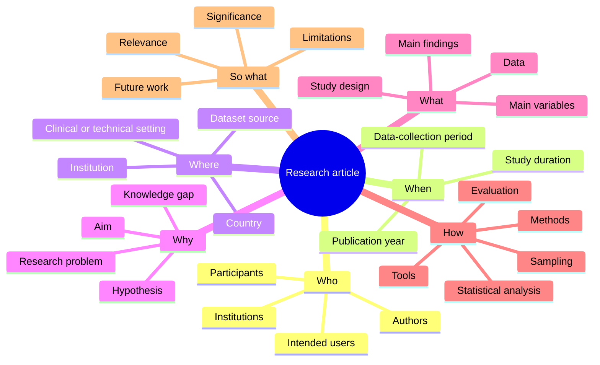

# Week 3: How to Prepare an Annotated Bibliography

> A practical guide to finding, selecting, evaluating, citing, summarising, and critically annotating academic literature.

---

## Learning objectives

By the end of this week, you should be able to:

1. Convert a broad research problem into focused research questions.
2. Design effective literature-search queries.
3. Search academic databases, repositories, and university libraries.
4. screen search results and select ten relevant articles.
5. Manage references and retrieve accurate citation metadata.
6. distinguish between citation styles such as APA, Harvard, Vancouver, and IEEE.
7. Summarise a research article using the **Who, When, Where, Why, What, and How** framework.
8. Critically evaluate an article rather than merely describing it.
9. Assess article quality using several indicators without relying on a single metric.
10. Produce a well-structured annotated bibliography.

---

## 1. What is an annotated bibliography?

An **annotated bibliography** is a list of academic sources in which each citation is followed by a short annotation.

A good annotation normally contains three components:

- **Summary:** What did the authors investigate and find?
- **Evaluation:** How credible, rigorous, and useful is the study?
- **Relevance:** How does the article relate to your research question?

An annotated bibliography is not simply a reference list. It demonstrates that you have:

- searched the literature systematically;
- understood the selected studies;
- evaluated their quality and limitations; and
- connected each study to your own research problem.

---

## 2. Overall workflow



---

# Part A — Finding the literature

## 3. Define the research problem

Begin with a broad topic, then convert it into a clear and researchable problem.

### Broad topic

> Artificial intelligence in healthcare

This topic is too broad. It may include diagnosis, hospital management, drug discovery, medical imaging, electronic health records, ethics, and many other areas.

### More focused problem

> The accuracy and limitations of deep-learning systems for detecting diabetic retinopathy from retinal images.

### Questions to ask

- What population or setting am I studying?
- What intervention, technology, method, or phenomenon interests me?
- What outcome am I examining?
- Is there a comparison group or alternative method?
- What time period, country, discipline, or context matters?
- What type of evidence do I need?

---

## 4. Break the problem into research questions

A single research problem can be divided into several smaller questions.

### Example

**Research problem:**  
How effective are deep-learning models for detecting diabetic retinopathy?

**Possible research questions:**

1. Which deep-learning architectures have been used?
2. What datasets were used to train and test the models?
3. How was model performance measured?
4. How do the models compare with clinicians or conventional methods?
5. Were the models externally validated?
6. What limitations or biases were reported?
7. Can the models be used safely in real clinical settings?

Breaking the problem into questions helps you create better search terms and prevents your search from becoming unfocused.

---

## 5. Identify concepts, keywords, and synonyms

Create a concept table before searching.

| Concept | Main term | Synonyms and related terms |
|---|---|---|
| Technology | deep learning | neural network, convolutional neural network, CNN, artificial intelligence, machine learning |
| Condition | diabetic retinopathy | retinal disease, diabetes-related eye disease |
| Task | detection | diagnosis, classification, screening, prediction |
| Data | retinal images | fundus images, fundus photography, ophthalmic imaging |
| Evaluation | accuracy | sensitivity, specificity, ROC-AUC, validation, performance |

Remember that authors may use different terms for the same idea.

---

## 6. Build search queries

### Boolean operators

| Operator | Purpose | Example |
|---|---|---|
| `AND` | Requires both concepts and narrows the search | `"deep learning" AND "diabetic retinopathy"` |
| `OR` | Includes synonyms and broadens the search | `"deep learning" OR "neural network"` |
| `NOT` | Excludes an unwanted concept; use cautiously | `retina NOT animal` |
| `" "` | Searches an exact phrase | `"diabetic retinopathy"` |
| `*` | Finds word variations where supported | `diagnos*` may find diagnosis, diagnostic, and diagnosing |
| `( )` | Groups related terms | `(CNN OR "deep learning") AND retina` |

### Example query

```text
("deep learning" OR "convolutional neural network" OR CNN)
AND
("diabetic retinopathy" OR "retinal disease")
AND
(detection OR diagnosis OR classification OR screening)
```

### Create several queries

Do not depend on only one search query.

```text
Query 1:
"deep learning" AND "diabetic retinopathy"

Query 2:
(CNN OR "convolutional neural network") AND "fundus images"

Query 3:
("artificial intelligence" OR "machine learning")
AND retinal screening
AND validation

Query 4:
"diabetic retinopathy" AND automated diagnosis
AND (sensitivity OR specificity OR AUC)
```

### Search log template

| Date | Database | Exact query | Filters | Results | Selected | Notes |
|---|---|---|---|---:|---:|---|
| YYYY-MM-DD | OpenAlex | Paste exact query | 2020–2026, article |  |  |  |
| YYYY-MM-DD | UQ Library | Paste exact query | Peer reviewed |  |  |  |
| YYYY-MM-DD | Google Scholar | Paste exact query | Since 2022 |  |  |  |

Keeping a search log makes your work transparent and reproducible.

---

## 7. Where to search

No single database contains every relevant article. Search more than one source.

### Open and freely accessible resources

| Resource | Best used for | Important note |
|---|---|---|
| [OpenAlex](https://openalex.org/) | Broad scholarly discovery, citation links, authors, institutions, and open-access information | A large open research catalogue; verify important metadata against the publisher or DOI record |
| [Google Scholar](https://scholar.google.com/) | Broad discovery, cited-by searching, related articles | Coverage is broad, but filters and metadata can be inconsistent |
| [arXiv](https://arxiv.org/) | Computer science, mathematics, statistics, physics, quantitative biology, and related preprints | arXiv material is not necessarily peer reviewed |
| [bioRxiv](https://www.biorxiv.org/) | Biology and life-science preprints | Check whether a peer-reviewed journal version now exists |
| [medRxiv](https://www.medrxiv.org/) | Health and medical preprints | Preliminary findings should not be treated as established clinical evidence |
| [PubMed](https://pubmed.ncbi.nlm.nih.gov/) | Biomedical and life-science literature | Primarily provides citations and abstracts, with full-text links where available |
| [PubMed Central](https://pmc.ncbi.nlm.nih.gov/) | Free full-text biomedical articles | Useful when the publisher copy is inaccessible |
| [Directory of Open Access Journals](https://doaj.org/) | Peer-reviewed open-access journals | Check the individual journal and article details |
| [CORE](https://core.ac.uk/) | Open-access papers from repositories | Confirm that you are reading the correct version |
| [Semantic Scholar](https://www.semanticscholar.org/) | Discovery, citation context, and related-paper exploration | Useful for discovery; verify bibliographic details |
| [Lens](https://www.lens.org/) | Scholarly works, patents, and citation exploration | Helpful for technology and innovation topics |
| [BASE](https://www.base-search.net/) | Academic repositories and open-access content | Coverage and metadata vary by repository |
| [Crossref Metadata Search](https://search.crossref.org/) | DOI and publication-metadata verification | Particularly useful for checking title, author, journal, and DOI details |

### University and institutional libraries

- [Kaplan Library](https://library.kaplan.edu.au/)
- [The University of Queensland Library](https://www.library.uq.edu.au/)
- Your institution's subject-specific library guides
- Databases subscribed to by your university, such as Scopus, Web of Science, IEEE Xplore, ACM Digital Library, ProQuest, EBSCOhost, ScienceDirect, or discipline-specific collections

University library access may provide full text that is unavailable through public search engines.

### Discipline-specific examples

| Discipline | Useful resources |
|---|---|
| Computing and information technology | IEEE Xplore, ACM Digital Library, arXiv, Scopus |
| Medicine and health | PubMed, MEDLINE, Embase, Cochrane Library, medRxiv |
| Biology | PubMed, bioRxiv, Web of Science, Scopus |
| Education | ERIC, Education Source, ProQuest Education |
| Business | Business Source Complete, ABI/INFORM, Scopus |
| Engineering | IEEE Xplore, Engineering Village, Scopus |
| Humanities and social sciences | JSTOR, Project MUSE, ProQuest, discipline-specific indexes |

> Availability depends on your institution's subscriptions.

---

## 8. Use different discovery methods

### Keyword searching

Search using your prepared concepts, synonyms, and Boolean operators.

### Backward citation searching

Read the reference list of a useful article to identify earlier studies.

### Forward citation searching

Use **Cited by** features to find later studies that cited the article.

### Related-article searching

Use features such as:

- Related articles
- Similar papers
- Recommended articles
- Connected works

### Author searching

Search for other work by important researchers in the field.

### Journal searching

Look within journals that frequently publish research on your topic.

### Review-paper searching

A recent systematic review or literature review can help you understand the field and locate important primary studies. However, do not rely only on reviews if the task requires original research articles.

---

# Part B — Screening and selecting articles

## 9. Establish inclusion and exclusion criteria

Define your criteria before choosing the final articles.

### Example inclusion criteria

- Published between 2020 and 2026
- Written in English
- Directly examines the research question
- Reports original empirical research
- Uses human retinal-image data
- Provides sufficient methodological detail
- Reports quantitative evaluation metrics
- Peer reviewed, unless preprints are intentionally included

### Example exclusion criteria

- Editorials, news items, or opinion pieces
- Studies unrelated to the target population
- Studies without relevant outcomes
- Duplicate records
- Conference abstracts without a full paper
- Articles for which sufficient information cannot be obtained
- Retracted publications
- Preprints replaced by a peer-reviewed journal version, unless version comparison is relevant

---

## 10. Screen articles in stages

### Stage 1: Title screening

Ask:

- Does the title appear relevant?
- Does it address at least one major concept?
- Is it clearly outside the topic?

### Stage 2: Abstract screening

Ask:

- What was the objective?
- What type of study was conducted?
- What data or participants were used?
- What were the main findings?
- Does it answer the research question?

### Stage 3: Full-text screening

Ask:

- Are the methods appropriate?
- Are the results relevant?
- Is sufficient evidence provided?
- Are limitations acknowledged?
- Is this one of the strongest ten articles for the task?

### Screening table

| Article | Title relevant? | Abstract relevant? | Full text available? | Include? | Reason |
|---|---:|---:|---:|---:|---|
| Article 1 | Yes | Yes | Yes | Yes | Directly answers RQ1 |
| Article 2 | Yes | No | Yes | No | Focuses on a different condition |
| Article 3 | Yes | Yes | No | No/Maybe | Insufficient information |

---

## 11. Select ten articles

The final set should not simply contain the first ten search results.

Aim for a balanced collection that may include:

- foundational studies;
- recent studies;
- studies using different methods;
- studies reporting contrasting findings;
- studies from relevant populations or settings;
- high-quality reviews for context; and
- primary research articles that directly answer the question.

Record why each article was selected.

---

# Part C — Managing references and citations

## 12. Save and organise the articles

Create a clear folder or reference-manager collection.

```text
Week-3-Annotated-Bibliography/
├── articles/
│   ├── 01_author_year_short-title.pdf
│   ├── 02_author_year_short-title.pdf
│   └── ...
├── notes/
│   ├── 01_annotation.md
│   ├── 02_annotation.md
│   └── ...
├── search-log.csv
├── screening-table.csv
└── annotated-bibliography.md
```

Use consistent filenames. Do not use names such as `paper1.pdf`, `final.pdf`, or `download(7).pdf`.

---

## 13. Reference-management tools

| Tool | Main strengths |
|---|---|
| [Zotero](https://www.zotero.org/) | Free and open source; collects, organises, annotates, cites, and shares references |
| [Mendeley Reference Manager](https://www.mendeley.com/reference-management/reference-manager) | PDF organisation, annotations, citation insertion, and synchronisation |
| [JabRef](https://www.jabref.org/) | Free and open source; particularly useful for BibTeX and LaTeX users |
| [Paperpile](https://paperpile.com/) | Browser-based reference management with Google Docs integration |
| [EndNote](https://endnote.com/) | Widely used commercial reference manager; may be available through a university |
| [BibDesk](https://bibdesk.sourceforge.io/) | BibTeX-focused reference management for macOS |

For a free and open-source workflow, **Zotero** or **JabRef** are strong options.

---

## 14. DOI and citation metadata

A **Digital Object Identifier (DOI)** is a persistent identifier assigned to many scholarly outputs.

Example:

```text
10.1038/s41588-024-00000-0
```

A DOI is useful for:

- locating an article;
- confirming its identity;
- retrieving citation metadata;
- linking to the persistent article record; and
- reducing ambiguity between similar titles.

Not every article has a DOI. Older papers, books, reports, theses, and some conference papers may use other identifiers.

### DOI and citation tools

- [Crossref Metadata Search](https://search.crossref.org/)
- [Crossref Simple Text Query](https://www.crossref.org/documentation/retrieve-metadata/simple-text-query/)
- [DOI.org](https://www.doi.org/)
- [DOI to BibTeX](https://www.doi2bib.org/)
- [Google Scholar](https://scholar.google.com/) — use the quotation-mark citation button
- The publisher's article page
- Zotero Connector
- Your lecturer's citation-tools website: **[Insert course citation-tools URL here]**

### Always verify automatically generated citations

Check:

- author names and order;
- publication year;
- article title;
- journal or conference title;
- volume and issue;
- page range or article number;
- DOI;
- capitalisation;
- punctuation; and
- citation style.

Automatically generated references often contain errors.

---

## 15. Citation styles

Use the style required by your course, lecturer, journal, or discipline.

### APA 7

Common in psychology, education, business, and social sciences.

```text
Author, A. A., & Author, B. B. (Year). Title of the article. Journal Title,
volume(issue), page–page. https://doi.org/xxxxx
```

### Harvard

An author–date style with institutional variations.

```text
Author, A.A. and Author, B.B. (Year) 'Title of article',
Journal Title, volume(issue), pp. xx–xx. doi:xxxxx.
```

### Vancouver

A numbered style common in medicine and health sciences.

```text
1. Author AA, Author BB. Title of article. Journal Title.
Year;volume(issue):pages. doi:xxxxx.
```

### IEEE

A numbered style common in engineering and computing.

```text
[1] A. A. Author and B. B. Author, "Title of article,"
Journal Title, vol. x, no. x, pp. xx–xx, Year,
doi: xxxxx.
```

### Important

- APA and Harvard use author–date in-text citations.
- Vancouver and IEEE normally use numbers.
- Harvard is not one completely uniform style; follow your institution's guide.
- Do not mix citation styles in one assignment.
- Use a hanging indent where required.
- Sort the bibliography according to the selected style.

---

# Part D — Reading and understanding each article

## 16. Read strategically

You do not always need to read every article from the first word to the last word in a single pass.

### First pass: Orientation

Read:

- title;
- abstract;
- keywords;
- section headings;
- figures and tables;
- conclusion.

Determine whether the article is relevant.

### Second pass: Understanding

Read:

- introduction;
- research question or hypothesis;
- methods;
- principal results;
- discussion.

Take structured notes.

### Third pass: Critical reading

Examine:

- research design;
- sample or dataset;
- measurements;
- analysis;
- assumptions;
- limitations;
- possible bias;
- generalisability;
- consistency between results and conclusions.

---

## 17. The 6W1H article mind map

For each article, capture the following:



### Note-taking template

| Question | Notes |
|---|---|
| **Who?** | Who conducted the study? Who or what was studied? |
| **When?** | When was it published and when were data collected? |
| **Where?** | Where was the study conducted or where did the data originate? |
| **Why?** | What problem, gap, aim, or hypothesis motivated the study? |
| **What?** | What design, data, variables, and findings were reported? |
| **How?** | How were data collected, analysed, and evaluated? |
| **So what?** | Why does the study matter, and how does it relate to your research? |

---

# Part E — Evaluating article quality

## 18. Do not use one metric alone

A journal impact factor, citation count, or prestigious journal name does **not** prove that an individual article is correct.

Evaluate quality using several forms of evidence.

---

## 19. Article-level evaluation

### Research question

- Is the question clear?
- Is it important?
- Is it answerable using the selected design?

### Study design

- Is the design appropriate?
- Is there a suitable comparison or control?
- Is the study prospective, retrospective, experimental, observational, qualitative, or computational?
- Does the design support the claims being made?

### Data or participants

- Is the sample large enough?
- Is the sample representative?
- Are inclusion and exclusion criteria clear?
- Could sampling bias be present?
- Is the dataset appropriate and accurately described?

### Methods

- Are the methods reproducible?
- Are tools and parameters reported?
- Are measurements valid?
- Are statistical or computational assumptions addressed?
- Is there appropriate training, validation, and independent testing where applicable?

### Results

- Are the results clearly reported?
- Are confidence intervals, effect sizes, or uncertainty provided?
- Are all relevant outcomes shown?
- Do tables and figures support the written claims?

### Interpretation

- Do the conclusions follow from the results?
- Are causal claims justified?
- Do the authors overgeneralise?
- Are alternative explanations considered?

### Transparency

- Are data, code, protocols, or supplementary materials available?
- Is funding disclosed?
- Are conflicts of interest disclosed?
- Has the article been corrected, withdrawn, or retracted?

---

## 20. Journal- and source-level indicators

### Peer review

Peer review means that experts evaluated the work before publication. It is an important quality-control process, but it does not guarantee that a paper is error-free.

### Journal Impact Factor

The Journal Impact Factor is a journal-level citation metric. It does not measure the quality of a specific article and should not be used alone to rank papers.

Do **not** write:

> This article is high quality because the journal has a high impact factor.

A better statement is:

> The article appeared in an established peer-reviewed journal, but its quality was assessed primarily from its study design, data, methods, reporting, and relevance.

### Journal quartiles

Some citation databases divide journals into quartiles:

- **Q1:** top 25% within a category
- **Q2:** 25%–50%
- **Q3:** 50%–75%
- **Q4:** bottom 25%

Quartiles depend on the database, year, and subject category.

### CiteScore

CiteScore is a Scopus-based journal metric calculated using citations to documents in a defined publication window. It is a journal indicator, not an article-quality score.

### SCImago Journal Rank

SJR weights citations according to the influence of the citing journals. It should be interpreted together with other information.

### Source Normalized Impact per Paper

SNIP adjusts citation impact for differences in citation behaviour between academic fields.

### Citation count

Citation counts can indicate influence, but they are affected by:

- article age;
- discipline;
- topic popularity;
- database coverage;
- self-citation;
- positive and negative citations; and
- whether the article is cited because it is useful, controversial, or flawed.

A recent excellent article may have few citations simply because it is new.

### h-index

The h-index is usually used to describe the publication and citation record of an author or sometimes a journal. It should not be used to determine whether a single article is trustworthy.

### Altmetrics

Altmetrics track online attention such as news, policy documents, blogs, and social media. Attention is not the same as scientific quality.

---

## 21. Suggested article-ranking rubric

Use the following rubric as a learning aid, not as an absolute truth.

Score each criterion from **0 to 2**.

| Criterion | 0 | 1 | 2 |
|---|---|---|---|
| Relevance | Weakly related | Partially related | Directly answers the question |
| Research design | Inappropriate or unclear | Acceptable with concerns | Strong and appropriate |
| Data/sample | Serious limitations | Some limitations | Suitable and well justified |
| Methods | Poorly described | Mostly adequate | Clear and reproducible |
| Analysis | Inappropriate or unclear | Generally suitable | Rigorous and transparent |
| Results | Unsupported or incomplete | Mostly supported | Clear and well supported |
| Limitations | Ignored | Mentioned briefly | Critically discussed |
| Transparency | Little information | Partial transparency | Data/code/protocols or strong reporting |
| Source status | Unverified/retracted concern | Preprint or unclear review | Peer reviewed and publication status verified |
| Usefulness | Little value | Some useful information | Highly useful for the research problem |

**Maximum score: 20**

### Interpretation

| Score | Suggested interpretation |
|---:|---|
| 17–20 | Strong candidate |
| 13–16 | Useful with some limitations |
| 9–12 | Use cautiously |
| 0–8 | Weak candidate or exclude |

Do not mechanically exclude an article because of one low score. A methodologically limited paper may still be important historically or may illustrate a research gap.

---

## 22. Quality-check table for ten articles

| Rank | Short citation | Relevance /2 | Methods /2 | Data /2 | Analysis /2 | Reporting /2 | Total /10 | Decision |
|---:|---|---:|---:|---:|---:|---:|---:|---|
| 1 | Author, Year |  |  |  |  |  |  | Include |
| 2 | Author, Year |  |  |  |  |  |  | Include |
| 3 | Author, Year |  |  |  |  |  |  | Include |

Add comments explaining the score. A number without justification is not a critical evaluation.

---

# Part F — Writing the annotation

## 23. Recommended annotation structure

Each annotation can follow this order:

1. Full citation
2. Study purpose
3. Methods and data
4. Main findings
5. Critical evaluation
6. Limitations
7. Relevance to your research question

### Suggested length

Follow the assessment instructions. A common annotation may be approximately **150–250 words**, but your required length may differ.

---

## 24. Empty annotation template

Copy this template for each article.

```markdown
## Article [Number]

### Full citation

[Insert the complete reference in the required citation style.]

### Research purpose

- **Problem or gap:**  
- **Aim or research question:**  
- **Hypothesis, if applicable:**  

### 6W1H summary

- **Who:**  
- **When:**  
- **Where:**  
- **Why:**  
- **What:**  
- **How:**  
- **So what:**  

### Methods

- **Study design:**  
- **Participants or dataset:**  
- **Sample size:**  
- **Variables or outcomes:**  
- **Tools or procedures:**  
- **Analysis:**  

### Main findings

-  
-  
-  

### Critical evaluation

**Strengths**

-  
-  

**Limitations**

-  
-  

**Quality and credibility**

- Was the article peer reviewed?  
- Was the publication status verified?  
- Were the methods appropriate and clearly reported?  
- Were uncertainty and limitations discussed?  
- Are data, code, or supplementary materials available?  
- Are conflicts of interest or funding sources disclosed?  

### Relevance to my research

[Explain specifically how this article informs your research question, method, argument, comparison, or identified gap.]

### Questions or follow-up reading

-  
-  

### Keywords

`keyword 1` · `keyword 2` · `keyword 3`
```

---

## 25. Paragraph-style annotation template

```markdown
### [Complete citation]

**Summary:**  
[State the purpose, study design, data or participants, methods, and principal
findings.]

**Evaluation:**  
[Evaluate methodological strengths, weaknesses, credibility, transparency,
possible bias, and whether the conclusions are supported.]

**Relevance:**  
[Explain exactly how this source contributes to your research question,
argument, method, comparison, or understanding of the research gap.]
```

---

## 26. Model annotation with placeholders

> Replace the placeholders with information from the selected article. Do not submit the example unchanged.

```markdown
### Author, A. A., & Author, B. B. (Year). Title of article. *Journal
Title, volume*(issue), pages. https://doi.org/xxxxx

This study investigated [research problem] using [study design] and data from
[sample, participants, organisation, or dataset]. The authors applied
[methods] to determine whether [research question or hypothesis]. The principal
finding was [main result], with [important supporting result or uncertainty].

A major strength of the study is [specific strength], which improves
[validity, reproducibility, generalisability, or relevance]. However,
[specific limitation] may have affected [particular result or interpretation].
The authors [did/did not] provide sufficient evidence for their conclusion
because [reason]. The article is directly relevant to the present research
question because it [provides a method, establishes a finding, offers a
comparison, identifies a limitation, or reveals a gap].
```

---

# Part G — Comparing the ten articles

## 27. Literature synthesis matrix

An annotated bibliography focuses on individual sources, but a synthesis matrix helps identify patterns across the literature.

| Theme | Article 1 | Article 2 | Article 3 | Article 4 |
|---|---|---|---|---|
| Research question |  |  |  |  |
| Dataset/sample |  |  |  |  |
| Method |  |  |  |  |
| Main result |  |  |  |  |
| Strength |  |  |  |  |
| Limitation |  |  |  |  |
| Research gap |  |  |  |  |

Look for:

- findings that agree;
- findings that conflict;
- frequently used methods;
- underrepresented populations;
- weak or missing validation;
- inconsistent definitions;
- unavailable data or code;
- unanswered questions; and
- opportunities for future research.

---

## 28. Identifying a research gap

A research gap is not simply:

> No one has studied this exact topic.

A useful gap may involve:

- a population not adequately represented;
- limited sample sizes;
- lack of external validation;
- inconsistent results;
- an outdated method;
- weak comparisons;
- absence of longitudinal evidence;
- insufficient real-world testing;
- unavailable data or code;
- neglected ethical or social implications;
- a missing integration between two research areas.

### Gap statement template

```text
Existing studies have demonstrated [what is known]. However, most studies
[shared limitation]. Consequently, it remains unclear whether [unanswered
question]. Further research is needed to [specific contribution].
```

---

# Part H — Accuracy, ethics, and academic integrity

## 29. Verify information from primary sources

Whenever possible, confirm bibliographic and factual information using:

1. the full article;
2. the publisher's official article page;
3. the DOI record;
4. the journal website;
5. the official dataset or project repository;
6. a university-library record.

Do not rely solely on:

- search-result snippets;
- AI-generated summaries;
- blogs;
- unsourced websites;
- automatically generated citations; or
- another student's bibliography.

---

## 30. Check publication status

Before including a source:

- confirm whether it is a preprint or peer-reviewed publication;
- check whether a later journal version exists;
- check for corrections or errata;
- check for expressions of concern;
- check for retraction notices;
- avoid counting the preprint and journal version as two independent studies.

Useful checks include:

- the publisher's page;
- [Crossmark](https://www.crossref.org/services/crossmark/);
- [Retraction Watch Database](https://retractionwatch.com/retraction-watch-database-user-guide/);
- PubMed publication notices;
- the DOI record.

---

## 31. Use AI responsibly

AI tools may assist with:

- generating keyword synonyms;
- explaining unfamiliar terminology;
- organising your own notes;
- suggesting a draft structure;
- checking grammar.

AI tools must not replace:

- reading the article;
- verifying citations;
- evaluating methods;
- checking results;
- writing your own critical analysis;
- following your institution's academic-integrity rules.

Never cite an article that you have not verified exists.

Never trust a generated DOI, quotation, statistic, or reference without checking the original source.

Record AI use if your course requires disclosure.

---

## 32. Avoid plagiarism

- Write annotations in your own words.
- Cite all ideas, findings, and quotations.
- Use quotation marks for exact wording.
- Keep direct quotations brief and purposeful.
- Do not closely imitate an abstract.
- Do not submit automatically generated text without checking and revising it.
- Follow the assessment's academic-integrity requirements.

---

# Part I — Final submission structure

## 33. Suggested Markdown structure

```text
# Annotated Bibliography: [Research Topic]

## Research question

[Insert the final research question.]

## Search strategy

- Databases searched:
- Search dates:
- Main concepts:
- Exact search strings:
- Filters:
- Inclusion criteria:
- Exclusion criteria:
- Number of records found:
- Number selected:

## Article 1

[Full citation]

[Annotation]

## Article 2

[Full citation]

[Annotation]

...

## Article 10

[Full citation]

[Annotation]

## Cross-article synthesis

[Explain patterns, disagreements, limitations, and gaps across the ten
articles.]

## Search reflection

[Explain what worked, what was difficult, and what you would change in a future
search.]
```

---

## 34. Final checklist

### Search process

- [ ] I stated a focused research question.
- [ ] I divided the problem into searchable concepts.
- [ ] I identified synonyms and related terms.
- [ ] I used Boolean operators correctly.
- [ ] I searched more than one appropriate database.
- [ ] I recorded my search strings and filters.
- [ ] I used clear inclusion and exclusion criteria.
- [ ] I screened titles, abstracts, and full texts.
- [ ] I selected ten genuinely relevant articles.

### References

- [ ] I used the required citation style.
- [ ] I checked every author name and publication year.
- [ ] I verified journal, volume, issue, pages, and DOI.
- [ ] I removed duplicate records.
- [ ] I did not count a preprint and its journal version as separate studies without justification.
- [ ] I used one citation style consistently.

### Annotations

- [ ] Each annotation explains the purpose.
- [ ] Each annotation identifies the methods and data.
- [ ] Each annotation reports the main findings accurately.
- [ ] Each annotation evaluates strengths and limitations.
- [ ] Each annotation explains relevance to my research.
- [ ] I distinguished description from critical evaluation.
- [ ] I did not copy the abstract.

### Quality and integrity

- [ ] I checked the article's publication status.
- [ ] I checked for corrections or retractions.
- [ ] I did not judge quality only by journal reputation or citation count.
- [ ] I verified AI-generated or automatically generated information.
- [ ] I followed academic-integrity requirements.
- [ ] I proofread the final document.

---

# Part J — Helpful resources

## Literature discovery

- [OpenAlex](https://openalex.org/)
- [Google Scholar](https://scholar.google.com/)
- [PubMed](https://pubmed.ncbi.nlm.nih.gov/)
- [arXiv](https://arxiv.org/)
- [bioRxiv](https://www.biorxiv.org/)
- [medRxiv](https://www.medrxiv.org/)
- [Directory of Open Access Journals](https://doaj.org/)
- [CORE](https://core.ac.uk/)
- [Semantic Scholar](https://www.semanticscholar.org/)
- [BASE](https://www.base-search.net/)

## Libraries

- [Kaplan Library](https://library.kaplan.edu.au/)
- [UQ Library](https://www.library.uq.edu.au/)
- [UQ Library Search guidance](https://web.library.uq.edu.au/find-and-borrow/searching-information)
- [UQ Library research techniques](https://guides.library.uq.edu.au/research-techniques)

## Citation and DOI tools

- [Zotero](https://www.zotero.org/)
- [JabRef](https://www.jabref.org/)
- [Crossref Metadata Search](https://search.crossref.org/)
- [Crossref Simple Text Query](https://www.crossref.org/documentation/retrieve-metadata/simple-text-query/)
- [DOI.org](https://www.doi.org/)
- [DOI to BibTeX](https://www.doi2bib.org/)
- **Course citation tools:** [Insert lecturer website URL]

## Research evaluation

- [Think. Check. Submit.](https://thinkchecksubmit.org/)
- [Committee on Publication Ethics](https://publicationethics.org/)
- [Crossmark](https://www.crossref.org/services/crossmark/)
- [Retraction Watch](https://retractionwatch.com/)
- [San Francisco Declaration on Research Assessment](https://sfdora.org/)

---

# Lecturer customisation notes

Before publishing this file for students, update the following:

1. Replace **[Insert course citation-tools URL here]** with the lecturer's website.
2. Confirm the required number of articles.
3. Confirm the required citation style.
4. Confirm the required annotation word count.
5. Add the assessment rubric.
6. Add the submission date and submission platform.
7. Add institution-specific academic-integrity guidance.
8. Remove resources that students cannot access.
9. Add screenshots only when their licence permits reuse.
10. Confirm whether Mermaid diagrams render on the selected GitHub platform.

---

## Licence suggestion

For teaching material published on GitHub, consider:

```text
Creative Commons Attribution 4.0 International (CC BY 4.0)
```

This allows reuse and adaptation with attribution. Confirm that all externally sourced images or material have compatible licences before including them.

---

## Key message

> A strong annotated bibliography is produced through a transparent search,
> careful selection, accurate citation, structured summary, critical
> evaluation, and a clear explanation of how each source contributes to the
> research problem.
