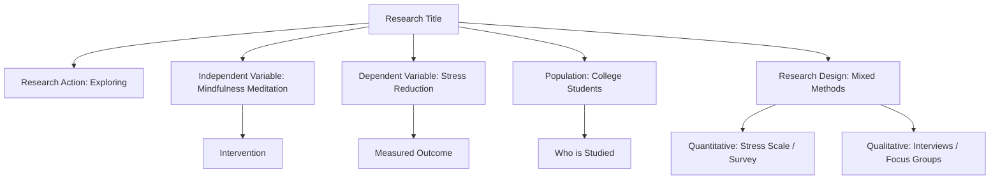
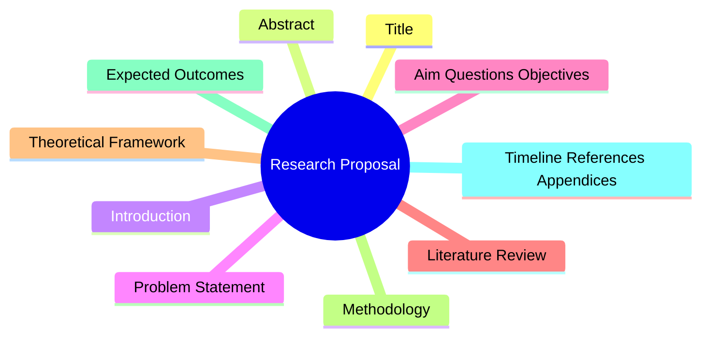
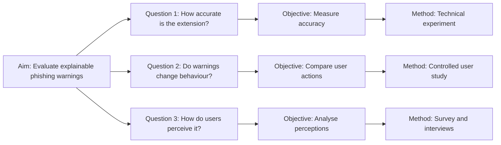
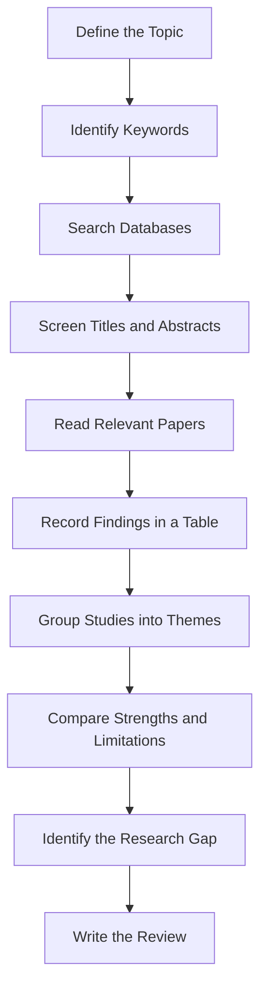
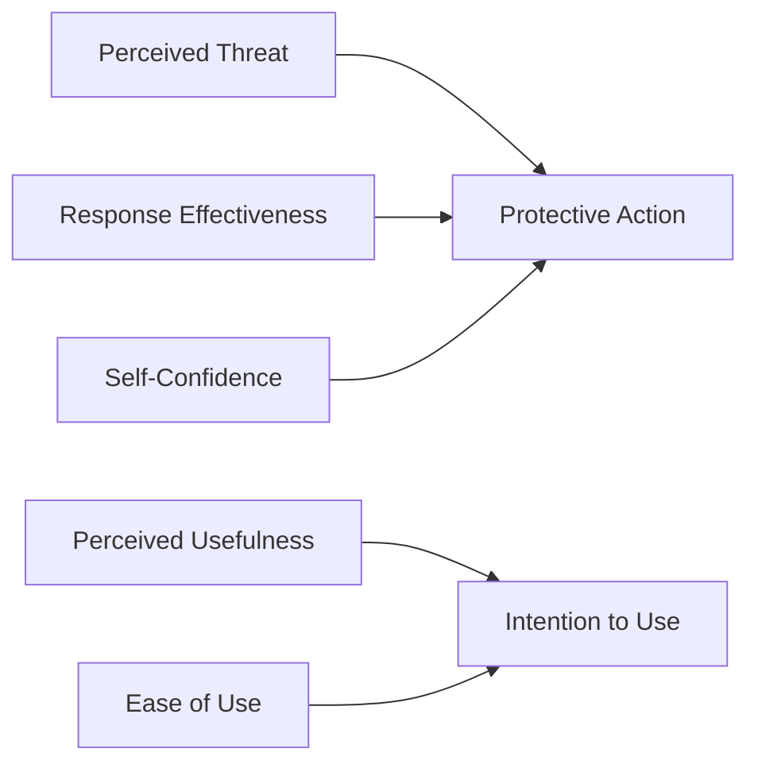
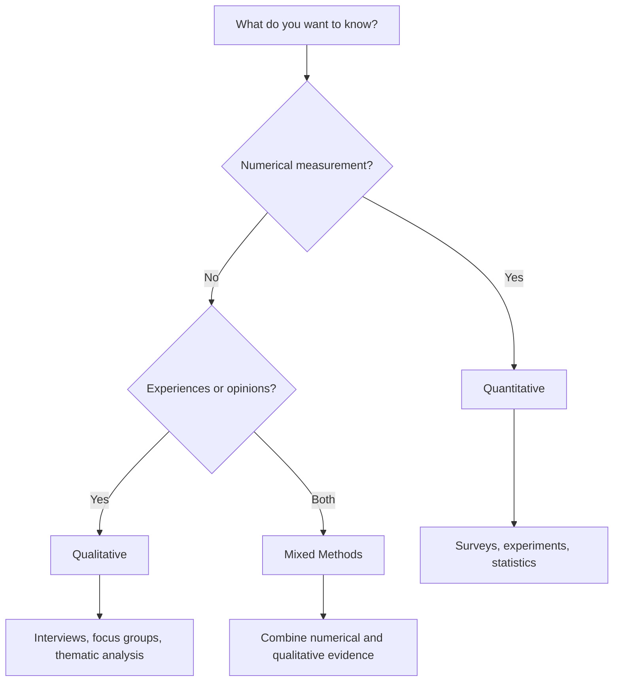
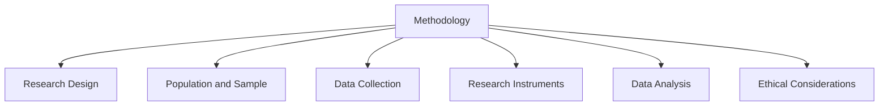
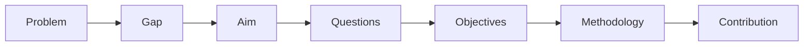

# Class 4 — Lecture 4  
# How to Create a Research Proposal

> **Purpose:** This lecture gives students a short, practical method for moving from a research problem to a complete proposal.

---

## Learning Outcomes

By the end of this lecture, students should be able to:

1. Identify a research problem and research gap.
2. Write a clear title, problem statement, aim, questions, and objectives.
3. Conduct a basic literature review.
4. Select an appropriate methodology.
5. Organise the main sections of a research proposal.

---

## Animated Overview


> The animation moves through the main stages: **Problem → Literature → Gap → Questions → Objectives → Methodology → Proposal**.

---

## 1. What Is a Research Proposal?

A **research proposal** is a formal plan explaining:

- **what** you want to study;
- **why** the research is needed;
- **who or what** will be studied;
- **how** the study will be conducted; and
- **what contribution** the research may make.

> A proposal is written **before** the research begins. It is a plan, not the final report.

---

## 2. Why Do We Need It?

A research proposal is needed because it:

- defines the problem clearly;
- shows that the topic is important;
- identifies a gap in current knowledge;
- explains how evidence will be collected;
- demonstrates that the project is realistic;
- guides the researcher; and
- supports approval, supervision, or funding.

---

## 3. The Complete Research Journey

```mermaid
flowchart LR
    A[Research Area] --> B[Research Problem]
    B --> C[Literature Review]
    C --> D[Research Gap]
    D --> E[Problem Statement]
    E --> F[Research Aim]
    F --> G[Research Questions]
    G --> H[Research Objectives]
    H --> I[Methodology]
    I --> J[Expected Contribution]
    J --> K[Research Proposal]
```



---

## 4. Connected Knowledge Graph of a Research Title

### Example title

> **Exploring the Effects of Mindfulness Meditation on Stress Reduction among College Students: A Mixed-Methods Study**



### Generic title formula

```text
[Research action] + [independent variable/topic]
+ on [dependent variable/outcome]
+ among [population]
+ : A [research design] study
```

### Example

```text
Evaluating the Effect of Explainable Phishing Warnings
on Safe Browsing Behaviour
among University Students:
A Mixed-Methods Study
```

---

## 5. Main Components of a Research Proposal

A basic proposal usually contains **10 core sections**.



| No. | Section | Purpose |
|---:|---|---|
| 1 | Title | States the topic, variables, population, and design |
| 2 | Abstract | Summarises the whole proposal |
| 3 | Introduction | Introduces the topic and context |
| 4 | Problem Statement | Defines the exact problem |
| 5 | Aim, Questions, Objectives | States what the study will achieve |
| 6 | Literature Review | Shows what is already known |
| 7 | Theoretical Framework | Explains the theory guiding the study |
| 8 | Methodology | Explains how the research will be conducted |
| 9 | Expected Outcomes | States the likely contribution |
| 10 | Timeline, References, Appendices | Shows feasibility and supporting material |

---

## 6. How to Write Each Section

<details>
<summary><strong>1. Research Title</strong></summary>

A good title identifies:

- the main topic or intervention;
- the outcome;
- the population or context; and
- the research design, if useful.

**Formula**

```text
[Action] + [Topic/Intervention] + [Outcome] + [Population] + [Design]
```

**Example**

> Evaluating the Effectiveness of an Explainable Phishing-Detection Extension among University Students: A Mixed-Methods Study

</details>

<details>
<summary><strong>2. Abstract</strong></summary>

The abstract is a **150–250 word summary** containing:

- the problem;
- the aim;
- the methods;
- the expected findings; and
- the contribution.

> Write it after completing the other sections.

</details>

<details>
<summary><strong>3. Introduction</strong></summary>

The introduction answers:

- What is the topic?
- Why is it important?
- Who is affected?
- What is the broader context?

**Example**

> Phishing websites imitate trusted organisations to steal passwords and personal information. Although browsers provide security warnings, users may still ignore them or fail to understand why a page is dangerous.

</details>

<details>
<summary><strong>4. Problem Statement</strong></summary>

### Formula

```text
[Population/context] experiences [problem].
Existing research or systems are limited because [gap].
This matters because [consequence].
Therefore, research is needed to investigate [focus].
```

### Example

> University students frequently receive suspicious links through email and social media. Existing browser warnings often provide limited explanation about why a website is dangerous. As a result, users may ignore warnings or remain unable to identify similar attacks. Therefore, research is needed to evaluate whether explainable phishing warnings improve safe browsing behaviour.

</details>

<details>
<summary><strong>5. Justification and Rationale</strong></summary>

This section explains:

- why the problem matters;
- what existing solutions fail to address;
- who may benefit; and
- what new contribution the study may provide.

### Formula

```text
The research is needed because [problem].
Existing studies mainly focus on [current approach].
However, they do not adequately address [gap].
The proposed study may contribute by [new contribution].
```

</details>

<details>
<summary><strong>6. Research Aim</strong></summary>

The aim is the **overall purpose** of the project.

### Formula

```text
The aim of this study is to
[investigate/develop/evaluate/examine]
[research topic]
among/in [population or context].
```

### Example

> The aim of this study is to develop and evaluate an explainable browser extension for detecting phishing websites among university students.

</details>

<details>
<summary><strong>7. Research Questions</strong></summary>

Research questions state what the researcher wants to discover.

### Example

1. How accurately can the extension identify phishing websites?
2. Do explainable warnings improve safe browsing decisions?
3. How do students perceive the usefulness and usability of the extension?

</details>

<details>
<summary><strong>8. Research Objectives</strong></summary>

Objectives are the **specific tasks** required to achieve the aim.

Use action verbs such as:

- identify;
- examine;
- develop;
- compare;
- measure;
- analyse; and
- evaluate.

### Example

1. Review existing phishing-detection techniques.
2. Develop an explainable browser extension.
3. Measure its detection accuracy.
4. Compare explainable warnings with generic warnings.
5. Analyse students’ responses and perceptions.

</details>

---

## 7. Aim–Question–Objective Alignment

Every question should have at least one matching objective and method.



---

## 8. How to Conduct a Literature Review



### Step 1 — Define the topic

Break the title into concepts.

**Example**

- phishing detection;
- browser extensions;
- explainable warnings;
- cybersecurity behaviour.

### Step 2 — Create search terms

```text
("phishing detection" OR "phishing website")
AND
("browser extension" OR "browser warning")
AND
("explainable" OR "user behaviour")
```

### Step 3 — Search academic databases

- Google Scholar
- IEEE Xplore
- ACM Digital Library
- Scopus
- Web of Science
- ScienceDirect

### Step 4 — Select relevant studies

Choose papers based on:

- relevance;
- publication quality;
- publication date;
- research method;
- full-text availability; and
- connection to the research questions.

### Step 5 — Create a literature table

| Study | Problem | Method | Main Finding | Limitation | Relevance |
|---|---|---|---|---|---|
| Study A | Generic warnings | User experiment | Warnings reduced unsafe clicks | Small sample | Supports warning evaluation |
| Study B | URL classification | Machine learning | High accuracy | No user testing | Supports model development |
| Study C | Warning comprehension | Interviews | Users preferred clear explanations | No working system | Supports interface design |

### Step 6 — Organise by themes

Possible themes:

1. Traditional phishing detection.
2. Machine-learning methods.
3. Browser-based systems.
4. Explainable warnings.
5. Warning fatigue and user behaviour.

### Step 7 — Identify the research gap

> Previous studies report strong phishing-classification accuracy, but fewer studies evaluate whether explainable warnings improve users’ real-time decisions.

---

## 9. Theoretical Framework

A theoretical framework is an established theory used to explain or predict behaviour.

### Example 1 — Protection Motivation Theory

People are more likely to take protective action when they believe:

- the threat is serious;
- they are personally at risk;
- the recommended response will work; and
- they can perform the response.

### Example 2 — Technology Acceptance Model

Technology adoption depends mainly on:

- perceived usefulness;
- perceived ease of use; and
- intention to use.



---

## 10. Choosing a Methodology



### Quantitative

Use when measuring:

- accuracy;
- frequency;
- scores;
- performance;
- relationships; or
- differences between groups.

### Qualitative

Use when exploring:

- experiences;
- perceptions;
- opinions;
- challenges; or
- explanations.

### Mixed Methods

Use when you need both:

- **numerical evidence**, and
- **detailed explanations**.

---

## 11. Methodology Structure

A methodology section normally contains:



### Example

> The study will use a mixed-methods design. A technical experiment will evaluate detection accuracy. A controlled user study will compare generic and explainable warnings. Surveys and interviews will examine participants’ perceptions and experiences.

---

## 12. Expected Outcomes and Contribution

Expected outcomes may include:

- a prototype;
- a dataset;
- a model;
- new evidence;
- recommendations;
- a framework; or
- practical guidelines.

### Example

> The study is expected to produce a working phishing-detection extension and evidence about whether explainable warnings improve users’ security decisions.

---

## 13. Complete Proposal Structure

```text
1. Title
2. Abstract
3. Introduction and Background
4. Problem Statement
5. Justification and Rationale
6. Research Aim
7. Research Questions
8. Research Objectives
9. Literature Review
10. Theoretical Framework
11. Methodology
12. Expected Outcomes and Significance
13. Timeline
14. References
15. Appendices
```

---

## 14. Final Quality Check



- [ ] Is the title clear and specific?
- [ ] Is the problem clearly defined?
- [ ] Is the research gap supported by literature?
- [ ] Is there one clear overall aim?
- [ ] Do the questions match the problem?
- [ ] Do the objectives match the questions?
- [ ] Does the methodology answer the questions?
- [ ] Are expected outcomes realistic?
- [ ] Are all sources referenced correctly?

---

## 15. Class Activity

Choose one IT problem and complete:

```text
Research area:

Research problem:

Population:

Research gap:

Research aim:

Research question 1:

Research question 2:

Objective 1:

Objective 2:

Research method:

Expected contribution:
```

### Suggested IT topics

- Detecting fake news using machine learning.
- Improving cybersecurity awareness.
- Identifying phishing websites.
- Predicting student performance.
- Evaluating AI chatbots in education.
- Detecting cyberbullying.
- Improving password security.
- Developing a job-recommendation system.
- Investigating privacy concerns in generative AI.

---

## Key Message

> A strong proposal connects every component logically:

```text
Problem → Gap → Aim → Questions → Objectives → Methodology → Contribution
```

---

## Compatibility Notes

- **Mermaid diagrams** work in platforms such as GitHub, GitLab, Obsidian, Typora, Notion, and many VS Code Markdown extensions.
- The **animated GIF** works in most Markdown viewers.
- The `<details>` sections are collapsible in GitHub and many HTML-enabled Markdown viewers.
- If Mermaid is not rendered, install a Mermaid-compatible Markdown preview extension or export the diagrams as images.
