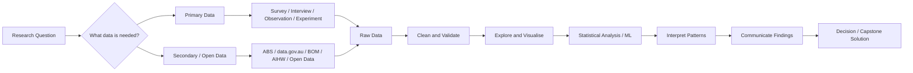
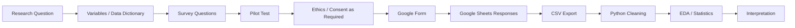
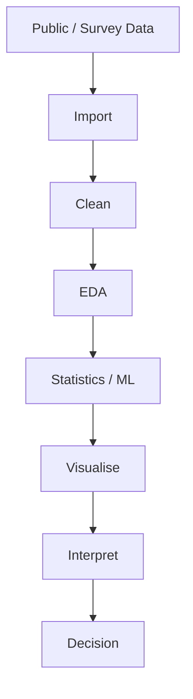

# IT Capstone – Data Collection and Data Analysis

> **Week 06 extended practical:** This workbook now connects the concepts of data collection and data analysis to **real Australian public datasets**, survey design, Google Forms automation, Python analysis, visualisation, and pattern discovery.

## Week 06 Learning Outcomes

By the end of this week, you should be able to:

1. Explain the difference between **primary** and **secondary** data.
2. Select an appropriate data collection method for an IT Capstone project.
3. Find and download **real publicly available Australian datasets**.
4. Use Australian Bureau of Statistics (ABS) Census products such as **QuickStats, Community Profiles, DataPacks, TableBuilder and Data Explorer**.
5. Import CSV/Excel/API data into Python.
6. Clean and explore a dataset using `pandas`.
7. Create charts and discover trends, groups, correlations and anomalies.
8. Design a survey and automatically create a **Google Form using Google Apps Script**.
9. Export survey responses to Google Sheets/CSV and analyse them in Python.
10. Document data provenance, privacy, ethics, limitations and reproducibility.

### The Big Picture



> **Core principle:** Start with the problem, not the tool. A beautiful dashboard or machine-learning model is not useful if the data does not answer the research question.

### Quick Links Used Throughout Week 06

| Resource | What it is useful for | Link |
|---|---|---|
| Australian Bureau of Statistics | National statistics and Census data | https://www.abs.gov.au/ |
| Find Census Data | Search Census data by area | https://www.abs.gov.au/census/find-census-data |
| ABS Census DataPacks | Bulk Census CSV downloads | https://www.abs.gov.au/census/find-census-data/datapacks |
| ABS Data Explorer | Build and download custom ABS tables | https://dataexplorer.abs.gov.au/ |
| ABS Data API | Programmatic access to ABS statistics | https://www.abs.gov.au/statistics/application-programming-interfaces-apis/data-api-user-guide |
| Australian Government Data | Federal, state and local open-data discovery | https://data.gov.au/ |
| Queensland Open Data | Queensland Government datasets | https://www.data.qld.gov.au/ |
| Brisbane City Council Open Data | Brisbane CSV, spatial and API datasets | https://data.brisbane.qld.gov.au/ |
| Bureau of Meteorology Climate Data Online | Historical weather and climate observations | https://www.bom.gov.au/climate/data/ |
| Australian Institute of Health and Welfare | Health and welfare reports/data | https://www.aihw.gov.au/reports-data |
| Google Forms | Primary survey collection | https://forms.google.com/ |
| Google Apps Script | Automate Google Forms and Sheets | https://script.google.com/ |
| Qualtrics | Research surveys | https://www.qualtrics.com/ |
| SurveyMonkey | Online questionnaires | https://www.surveymonkey.com/ |
| Microsoft Forms | Surveys and quizzes | https://forms.office.com/ |
| Typeform | Interactive online forms | https://www.typeform.com/ |

---

## 1. What is Data Collection?

**Data collection** is the process of gathering information from different sources so that a problem can be understood, investigated, and solved.

In an **IT Capstone project**, data may be collected from users, software systems, databases, sensors, websites, surveys, or experiments.

### Example

Suppose an IT Capstone team is developing a **Student Learning Analytics System**.

The team could collect:

- Student attendance
- Assessment marks
- LMS login frequency
- Time spent on learning activities
- Student feedback
- Assignment submission dates

The collected data can then be analysed to identify students who may require additional academic support.

---

# 2. Why Do We Collect Data?

| Reason | Description | IT Capstone Example |
|---|---|---|
| **Informed Decision-Making** | Helps organisations make decisions using evidence rather than assumptions. | Analyse help-desk tickets before deciding whether a new support system is required. |
| **Evidence-Based Research** | Provides evidence to support or reject research questions. | Determine whether an AI chatbot improves student support. |
| **Problem Solving** | Helps identify the causes of problems. | Analyse network logs to determine why a system frequently crashes. |
| **Performance Evaluation** | Measures whether a system or solution is performing effectively. | Compare website response time before and after optimisation. |
| **Understanding Users** | Identifies user behaviour, needs, and preferences. | Survey students about features required in a university mobile application. |
| **Prediction** | Historical data can help predict future events. | Predict students at risk of failing a course. |
| **Innovation** | Data may reveal new opportunities and solutions. | Analyse transport data to design a smart parking application. |
| **Risk Management** | Helps identify possible risks and threats. | Analyse cybersecurity logs to detect suspicious activity. |
| **Validation** | Determines whether the proposed solution actually works. | Test whether a new recommendation system improves click-through rate. |

---

# 3. Primary and Secondary Data

## Primary Data

**Primary data** is collected directly by the researcher for a specific project.

Examples:

- Surveys
- Interviews
- Experiments
- Observations
- Focus groups
- Sensor measurements

### IT Capstone Example

A team developing a university application interviews **30 students** to identify problems with the existing system.

---

## Secondary Data

**Secondary data** already exists and was originally collected by another person or organisation.

Examples:

- Government datasets
- Company databases
- Research datasets
- Australian Bureau of Statistics datasets
- Kaggle datasets
- Published research
- Open government data
- Existing system logs

### IT Capstone Example

A team developing a traffic prediction system downloads an existing traffic dataset rather than collecting traffic information manually.

# 3A. Australian Public Data for IT Capstone Projects

Australia has a large ecosystem of public datasets that can be used as **secondary data**. These datasets are particularly useful when a Capstone team does not have the time, resources, ethics approval, or sample size required to collect everything from scratch.

## Important Census Update for This Week

The **2026 Australian Census was held on 11 August 2026**, but the 2026 results are **not yet available for analysis**. The ABS plans the first 2026 Census data release for **June 2027**, followed by later releases. Therefore, the **2021 Census is currently the latest fully released Census dataset** for hands-on analysis.

Use:

- 2021 Census for current classroom analysis.
- 2016 and 2011 Census data for historical comparison.
- 2026 Census dictionary/product information to understand what will become available later.

Official links:

- 2021/earlier Census data: https://www.abs.gov.au/census/find-census-data
- 2026 Census product guide: https://www.abs.gov.au/census/guide-census-data/2026-census-product-guide/2026
- 2026 Census dictionary: https://www.abs.gov.au/census/guide-census-data/census-dictionary/latest-release

## What Does the Australian Census Contain?

The Census provides aggregated information about people, families and dwellings. Depending on the product and geography, examples include:

- Population and age
- Sex and gender-related variables available for the relevant Census year
- Household and family composition
- Education
- Employment and occupation
- Income
- Housing and tenure
- Language used at home
- Country of birth
- Need for assistance
- Travel to work
- Geographic location

> **Important:** Public Census tables are statistical outputs. Do not treat them as a list of identifiable individuals.

## ABS Census Tools — Which One Should I Use?

| ABS Product | Best For | Output / Use | Capstone Example |
|---|---|---|---|
| **QuickStats** | Fast understanding of one area | Web summary | Describe the demographic profile of Brisbane or a suburb |
| **Community Profiles** | Detailed predefined tables | Excel spreadsheets | Compare education, income and household variables |
| **DataPacks** | Bulk analysis | ZIP/CSV + metadata | Analyse hundreds of SA2/LGA areas with Python |
| **TableBuilder** | Custom cross-tabulations | User-built tables; downloadable | Compare age × education × geography |
| **Data Explorer** | Interactive ABS statistics | Tables, CSV and API workflow | Explore population/economic statistics and download only what is needed |
| **ABS Data API** | Automation/reproducibility | SDMX REST API | Refresh an analysis without manually downloading every table |
| **GeoPackages / boundaries** | Spatial analysis | Geographic files | Map Census patterns with `geopandas` or QGIS |

## Understanding Australian Geographies

You will often see geographic abbreviations in ABS data.

| Geography | Meaning | Typical Use |
|---|---|---|
| **AUS** | Australia | National analysis |
| **STE** | State/Territory | Compare Queensland, NSW, Victoria, etc. |
| **GCCSA** | Greater Capital City Statistical Area | Compare Greater Brisbane, Sydney, Melbourne, etc. |
| **LGA** | Local Government Area | Council-level projects |
| **SA4** | Statistical Area Level 4 | Large labour-market/regional analysis |
| **SA3** | Statistical Area Level 3 | Regional analysis |
| **SA2** | Statistical Area Level 2 | Excellent level for many local Capstone analyses |
| **SA1** | Statistical Area Level 1 | Fine-grained aggregate analysis |
| **POA** | Postal Area | Postcode-like analysis |
| **SAL** | Suburbs and Localities | Suburb/locality-based projects |

Australian Statistical Geography Standard information:

https://www.abs.gov.au/statistics/statistical-geography/australian-statistical-geography-standard-asgs

## How to Download 2021 Census Data — Beginner Method

### Method A — QuickStats

1. Open: https://www.abs.gov.au/census/find-census-data
2. Select **2021**.
3. Search for a place such as `Brisbane`, `Gold Coast`, `Queensland`, an LGA, postcode or suburb.
4. Open **QuickStats**.
5. Read the key indicators.
6. Record the source, geography, Census year and access date.

Use QuickStats when you need a fast profile rather than a large machine-readable dataset.

### Method B — Community Profiles

1. Open **Find Census Data**.
2. Select an area.
3. Open **Community Profiles**.
4. Download the spreadsheet.
5. Read the workbook documentation and table labels before analysing.
6. Import the required worksheet into Excel, Power BI, R or Python.

### Method C — DataPacks for Python

1. Open: https://www.abs.gov.au/census/find-census-data/datapacks
2. Select **2021**.
3. Select a profile such as **General Community Profile**.
4. Select a geography such as **SA2** or **LGA**.
5. Select Australia or a state such as Queensland.
6. Prefer **short-header** files when you want easier programmatic column handling.
7. Download the ZIP file.
8. Extract it.
9. Keep the accompanying metadata and descriptor files — do not analyse codes without understanding their definitions.

### Method D — Data Explorer

1. Open: https://dataexplorer.abs.gov.au/
2. Search for a dataset/topic.
3. Select dimensions and filters.
4. Arrange rows and columns.
5. Download the resulting table.
6. For reproducible workflows, use Data Explorer's developer/API options to generate the corresponding API request.

## Publicly Accessible ABS Visual Example


*Source: Australian Bureau of Statistics, Search Census Data interface. Source page: https://www.abs.gov.au/census/guide-census-data/about-census-tools/search-census-data. If reusing an image outside teaching notes, check the source page's current attribution/reuse requirements.*

## Other High-Value Australian Public Data Sources

| Source | Example Data | How to Access | Possible IT Capstone Project |
|---|---|---|---|
| **data.gov.au** | Government datasets from many agencies | Search and download resources; many datasets expose APIs | Build a searchable public-services dashboard |
| **Queensland Open Data** | Transport, environment, government, spatial data | CSV, JSON, SHP, APIs depending on dataset | Queensland traffic or service-demand analytics |
| **Brisbane City Council Open Data** | Facilities, roads, parks, spatial datasets | CSV, GeoJSON, spatial download, API | Smart-city map or facility accessibility tool |
| **Bureau of Meteorology (BOM)** | Rainfall, temperature, weather stations, climate statistics | Climate Data Online / CSV | Weather trend dashboard or heat-risk analysis |
| **AIHW** | Health, hospitals, housing, mental health, welfare | Downloadable tables/reports | Health-service demand or regional indicator dashboard |
| **ABS** | Population, labour, prices, Census, economy, education | Excel, CSV, TableBuilder, Data Explorer, API | Demographic, socioeconomic or market analysis |

### Direct Links

- Australian Government Data: https://data.gov.au/
- Queensland Open Data: https://www.data.qld.gov.au/
- Brisbane Open Data: https://data.brisbane.qld.gov.au/
- BOM Climate Data Online: https://www.bom.gov.au/climate/data/
- AIHW Reports & Data: https://www.aihw.gov.au/reports-data
- ABS: https://www.abs.gov.au/

## Example Research Questions Using Public Australian Data

### Census / Demography

> Which Brisbane SA2 areas have older populations, and where might digital-access services need to be designed for older users?

### Transport

> Which areas have high transport demand, and can public datasets help identify locations for a journey-planning application?

### Weather

> What seasonal patterns exist in Brisbane temperature and rainfall, and how could these patterns support an outdoor-event planning application?

### Health

> How do selected health indicators differ between regions, and how could a dashboard communicate those differences to decision-makers?

### Smart City

> Can council open data be used to map public facilities and identify areas with lower accessibility?

---

# 4. Data Collection Methods

| Method | Description | Example | IT Capstone Example |
|---|---|---|---|
| **Survey** | Collect responses using structured questions. | Online questionnaire | Survey students about an LMS. |
| **Interview** | Ask detailed questions directly to participants. | One-to-one interview | Interview IT staff about cybersecurity problems. |
| **Observation** | Observe behaviour or activities. | Observe users interacting with software | Observe how users navigate an application. |
| **Experiment** | Change one factor and measure the result. | A/B testing | Compare two website interfaces. |
| **Case Study** | Detailed investigation of one organisation, project, or situation. | Study one company's digital transformation | Investigate an organisation implementing cloud computing. |
| **Existing Data Sources** | Analyse previously collected information. | Government dataset | Use ABS or open government datasets. |
| **Focus Groups** | Guided discussion with a group of participants. | Group of 8 users | Discuss requirements for a new mobile application. |
| **Content Analysis** | Analyse documents, websites, text, or media. | Analyse customer reviews | Analyse app-store reviews. |
| **Diaries** | Participants record activities over time. | Daily technology diary | Users record application problems for two weeks. |
| **Sensor Data** | Automatically collect measurements using sensors. | Temperature sensor | IoT system monitoring a smart building. |
| **Social Media Data** | Collect publicly available social-media information. | Posts or comments | Analyse sentiment about a company. |
| **Audio Recording** | Record spoken information. | Interview recordings | Analyse customer service conversations. |
| **Video Recording** | Capture user actions or behaviour. | Usability testing | Record participants using an application. |
| **Photography** | Images used as research data. | Infrastructure photographs | Identify damaged equipment using computer vision. |
| **Biometrics** | Physiological or behavioural measurements. | Fingerprint, heart rate | Authentication system using facial recognition. |
| **Sampling** | Select a smaller group from a larger population. | 100 students from 5,000 students | Survey a representative sample of university students. |

---

# 5. Sampling

It is often impossible to collect information from an entire population.

A **sample** is a smaller group selected from the population.

### Example

**Population:** 10,000 university students

**Sample:** 500 university students

The 500 students are surveyed to estimate the opinions of the larger student population.

## Common Sampling Techniques

| Sampling Method | Description |
|---|---|
| **Random Sampling** | Every person has an equal chance of selection. |
| **Systematic Sampling** | Select every nth person or record. |
| **Stratified Sampling** | Divide the population into groups and sample each group. |
| **Cluster Sampling** | Select complete groups or clusters. |
| **Convenience Sampling** | Select participants who are easily available. |
| **Purposive Sampling** | Select participants with particular knowledge or characteristics. |

---

# 6. Tools for Data Collection

| Tool | Type | Typical Use |
|---|---|---|
| **SurveyMonkey** | Online survey | Customer and research surveys |
| **Google Forms** | Online forms | Simple questionnaires and feedback |
| **Qualtrics** | Research survey platform | Academic and professional research |
| **Typeform** | Interactive forms | User-friendly questionnaires |
| **Microsoft Forms** | Online forms | Surveys, quizzes, and organisational feedback |
| **Paper Surveys** | Traditional survey | Situations where digital access is unavailable |
| **Mobile Data Collection Apps** | Mobile collection | Field research |
| **Excel** | Spreadsheet | Manual data entry |
| **Google Sheets** | Cloud spreadsheet | Collaborative data collection |
| **APIs** | Automated data collection | Collect information from software platforms |
| **Sensors / IoT Devices** | Automated measurement | Environmental and device monitoring |
| **System Logs** | Automatic system records | Cybersecurity and application monitoring |

# 6A. Live Links to Data Collection and Survey Tools

The tools already introduced above are useful for different purposes. Do not choose a tool only because it is familiar — choose it because it fits the data, respondents, privacy requirements and analysis plan.

| Tool | Best Use | Link | Export / Integration |
|---|---|---|---|
| **Google Forms** | Fast surveys, feedback, classroom projects | https://forms.google.com/ | Google Sheets, CSV |
| **Google Apps Script** | Automatically create/manage Forms and Sheets | https://script.google.com/ | JavaScript automation |
| **SurveyMonkey** | General online survey design | https://www.surveymonkey.com/ | CSV/XLSX depending on plan |
| **Qualtrics** | Academic/research survey workflows | https://www.qualtrics.com/ | CSV/XLSX/SPSS and integrations depending on licence |
| **Typeform** | Visually interactive forms | https://www.typeform.com/ | CSV and integrations |
| **Microsoft Forms** | Microsoft 365 surveys and quizzes | https://forms.office.com/ | Excel |
| **KoboToolbox** | Field/humanitarian/mobile data collection | https://www.kobotoolbox.org/ | CSV/XLSX/API |
| **REDCap** | Research data capture where an institution provides access | https://projectredcap.org/ | CSV/statistical packages/API depending on deployment |
| **Google Sheets** | Collaborative tabular collection | https://sheets.google.com/ | CSV/XLSX/API |
| **Excel** | Local tabular data entry | https://www.microsoft.com/microsoft-365/excel | CSV/XLSX |

## Survey Design Before You Build the Form

Before opening a survey platform, write a **data dictionary**.

| Variable | Question | Type | Allowed Values | Why Needed? |
|---|---|---|---|---|
| `age_group` | What is your age group? | Ordinal category | 18–24, 25–34, ... | Compare user groups |
| `platform_use` | How often do you use the platform? | Ordinal | Never → Daily | Measure engagement |
| `satisfaction` | Rate your satisfaction | Likert / numeric | 1–5 | Main outcome |
| `features` | Which features do you use? | Multi-select | Search, Chat, Upload, ... | Feature usage |
| `comment` | What should be improved? | Free text | Text | Qualitative feedback |

> **Good practice:** Decide how each survey question will be analysed **before** collecting responses.

## Question-Type Selection Guide

| Research Need | Recommended Question Type | Example Analysis |
|---|---|---|
| Choose one category | Multiple choice | Counts, percentages, chi-square |
| Choose several options | Checkboxes | Frequency of each option |
| Measure agreement/satisfaction | 1–5 or 1–7 Likert scale | Median, distribution, group comparisons |
| Capture a number | Validated numeric text field | Mean, SD, regression |
| Understand reasons | Paragraph/free text | Coding, themes, NLP |
| Capture a date | Date question | Time-based analysis |

---

# 7. Example IT Capstone Dataset

Consider an IT Capstone project:

## Student Success Prediction System

A dataset could contain:

| Student_ID | Attendance | LMS_Logins | Study_Hours | Assignment_Score | Final_Result |
|---|---:|---:|---:|---:|---|
| S001 | 92 | 75 | 12 | 84 | Pass |
| S002 | 62 | 31 | 5 | 55 | Pass |
| S003 | 45 | 14 | 2 | 39 | Fail |
| S004 | 88 | 68 | 10 | 81 | Pass |
| S005 | 51 | 22 | 4 | 44 | Fail |

Possible questions:

- Does attendance affect academic performance?
- Are LMS logins associated with higher marks?
- Can we predict whether a student is likely to fail?
- Which factors contribute most to student performance?

---

# 8. What is Data Analysis?

**Data analysis** is the process of inspecting, cleaning, transforming, modelling, and interpreting data to discover useful information.

A simplified process is:

**Data → Information → Insight → Decision**

---

# 9. Why is Data Analysis Important?

| Purpose | Description | IT Capstone Example |
|---|---|---|
| **Informed Decision-Making** | Supports decisions using evidence. | Decide which software feature should be developed. |
| **Problem Solving** | Identifies causes of problems. | Determine why customers abandon an online checkout. |
| **Performance Evaluation** | Measures performance. | Compare system performance before and after optimisation. |
| **Market Research** | Understand customers and markets. | Analyse user preferences for an application. |
| **Customer Insights** | Understand customer behaviour. | Identify frequently used application features. |
| **Predictive Analysis** | Predict future outcomes. | Predict customer churn. |
| **Cost Optimisation** | Identify opportunities to reduce costs. | Analyse cloud usage to reduce unnecessary computing costs. |
| **Research and Innovation** | Discover patterns and develop new ideas. | Develop a machine-learning recommendation system. |
| **Compliance** | Ensure rules and standards are followed. | Analyse access logs for privacy compliance. |
| **Risk Management** | Identify possible risks. | Detect unusual financial transactions. |
| **Policy Making** | Support organisational or government policies. | Analyse transport data before changing public transport policy. |

---

# 10. The Data Analysis Process

A common data analysis workflow is:

```text
Define the Problem
        ↓
Collect Data
        ↓
Clean Data
        ↓
Explore Data
        ↓
Transform Data
        ↓
Choose Analysis Method
        ↓
Analyse / Model Data
        ↓
Interpret Results
        ↓
Validate and Evaluate
        ↓
Communicate Findings
        ↓
Make Decisions
```

---

# 11. Step 1 – Define the Problem

Clearly identify the question that the project is trying to answer.

### Example

> Can student attendance and LMS activity be used to predict academic failure?

---

# 12. Step 2 – Collect the Data

Determine:

- What data is required?
- Where will it come from?
- How will it be collected?
- Who will provide it?
- Are there ethical or privacy issues?

### Example

Collect:

- Attendance
- LMS activity
- Assignment marks
- Study hours
- Final results

---

# 13. Step 3 – Data Cleaning

Data cleaning improves the quality of the dataset.

Common activities include:

- Handling missing values
- Removing duplicates
- Correcting errors
- Standardising formats
- Detecting unusual values
- Correcting incorrect categories

### Example

Before cleaning:

```text
Age
21
22
-4
20
NA
```

Problems:

- `-4` is not a valid age.
- `NA` represents missing data.

---

# 14. Step 4 – Exploratory Data Analysis

**Exploratory Data Analysis (EDA)** helps researchers understand the dataset before performing advanced analysis.

Typical activities include:

- Summary statistics
- Histograms
- Scatter plots
- Box plots
- Correlation analysis
- Outlier detection

Example question:

> Do students with higher attendance generally receive higher marks?

# 14A. Practical EDA — From Downloaded File to Pattern Discovery

A useful EDA sequence is:

```text
Load → Inspect → Clean → Describe → Visualise → Compare → Test → Interpret
```

## Step 1 — Load a CSV or Excel File

```python
import pandas as pd

# CSV
# df = pd.read_csv("data.csv")

# Excel
# df = pd.read_excel("data.xlsx", sheet_name="Sheet1")

print(df.head())
print(df.shape)
print(df.columns)
```

## Step 2 — Inspect Data Types and Missing Values

```python
print(df.info())
print(df.isna().sum().sort_values(ascending=False).head(20))
print(df.duplicated().sum())
```

## Step 3 — Clean

```python
# Example only — choose rules that make sense for your dataset.
df = df.drop_duplicates()

df.columns = (
    df.columns
      .str.strip()
      .str.lower()
      .str.replace(" ", "_", regex=False)
)
```

## Step 4 — Describe Numerical and Categorical Variables

```python
print(df.describe(include="all").T)

for col in df.select_dtypes(include="object").columns[:5]:
    print("\n", col)
    print(df[col].value_counts(dropna=False).head(10))
```

## Step 5 — Visualise Distributions

```python
import matplotlib.pyplot as plt

numeric_cols = df.select_dtypes(include="number").columns

if len(numeric_cols) > 0:
    col = numeric_cols[0]
    df[col].dropna().plot(kind="hist", bins=20)
    plt.title(f"Distribution of {col}")
    plt.xlabel(col)
    plt.ylabel("Frequency")
    plt.show()
```

## Step 6 — Discover Relationships

```python
numeric = df.select_dtypes(include="number")

if numeric.shape[1] >= 2:
    corr = numeric.corr()
    print(corr.round(2))
```

A correlation is a **pattern**, not automatically a causal relationship.

## Step 7 — Discover Groups

```python
# Example: compare a numeric outcome across categories.
# Replace category_col and value_col with real columns.

# summary = (
#     df.groupby("category_col")["value_col"]
#       .agg(["count", "mean", "median", "std"])
#       .sort_values("mean", ascending=False)
# )
# print(summary)
```

## Step 8 — Detect Potential Outliers

```python
# IQR method for one numerical column.
# col = "value_col"
# q1 = df[col].quantile(0.25)
# q3 = df[col].quantile(0.75)
# iqr = q3 - q1
# lower = q1 - 1.5 * iqr
# upper = q3 + 1.5 * iqr
# outliers = df[(df[col] < lower) | (df[col] > upper)]
# print(outliers)
```

## Pattern-Discovery Questions to Ask

- Which values are most common?
- Which groups differ the most?
- Is there a trend over time?
- Do two variables move together?
- Are there clusters of similar observations?
- Are there unusual records?
- Are patterns different by geography?
- Does the pattern remain after cleaning the data?
- Is the pattern large enough to matter in practice?
- Could bias, missing data or confounding explain it?

---

# 15. Data Analysis Methods

| Method | Main Question | Example |
|---|---|---|
| **Descriptive Analysis** | What happened? | Average student mark |
| **Exploratory Analysis** | What patterns exist? | Discover relationships between attendance and marks |
| **Diagnostic Analysis** | Why did it happen? | Why did website traffic decrease? |
| **Inferential Analysis** | What can we conclude about the population? | Estimate student satisfaction using a sample |
| **Predictive Analysis** | What is likely to happen? | Predict student failure |
| **Prescriptive Analysis** | What should we do? | Recommend interventions for at-risk students |
| **Causal Analysis** | Did X cause Y? | Did a new teaching system improve results? |
| **Quantitative Analysis** | What numerical relationships exist? | Analyse survey ratings |
| **Text Analysis** | What information exists in text? | Analyse customer reviews |
| **Spatial Analysis** | Where are patterns occurring? | Analyse crime locations |
| **Time-Series Analysis** | How does something change over time? | Analyse monthly website traffic |
| **Cluster Analysis** | What natural groups exist? | Group customers based on purchasing behaviour |
| **Anomaly Detection** | What observations are unusual? | Detect suspicious network activity |

---

# 16. Common Data Analysis Techniques

## Descriptive Statistics

Used to summarise data.

Examples:

- Mean
- Median
- Mode
- Minimum
- Maximum
- Range
- Variance
- Standard deviation
- Percentages

### Example

Marks:

```text
65, 70, 75, 80, 90
```

Mean:

```text
(65 + 70 + 75 + 80 + 90) / 5 = 76
```

---

# 17. Regression Analysis

Regression investigates relationships between variables.

### Example

Predict:

```text
Student Mark
```

using:

```text
Attendance
Study Hours
LMS Activity
```

Conceptually:

```text
Student Mark
     ↑
     |
Attendance + Study Hours + LMS Activity
```

---

# 18. Time-Series Analysis

Used when observations are collected over time.

Examples:

- Daily website traffic
- Monthly company sales
- Hourly electricity consumption
- Weekly cybersecurity attacks

Example:

```text
Month      Website Visits

January       10,000
February      12,500
March         14,200
April         16,100
```

The organisation can identify trends and forecast future traffic.

---

# 19. Cluster Analysis

Cluster analysis groups similar observations together.

### Example

An e-commerce company could identify:

```text
Customers
   |
   +---- Cluster 1 → Frequent buyers
   |
   +---- Cluster 2 → Occasional buyers
   |
   +---- Cluster 3 → High-value customers
   |
   +---- Cluster 4 → Inactive customers
```

---

# 20. Principal Component Analysis – PCA

**Principal Component Analysis (PCA)** reduces a large number of variables into fewer components while preserving important information.

Example dataset:

```text
Age
Income
Website Visits
Products Purchased
Time on Website
Number of Searches
Customer Rating
```

PCA may reduce these variables into:

```text
PC1 → Customer Engagement
PC2 → Purchasing Behaviour
PC3 → Customer Characteristics
```

---

# 21. Machine Learning

Machine-learning algorithms identify patterns and make predictions.

Common algorithms include:

- Linear Regression
- Logistic Regression
- Decision Tree
- Random Forest
- Support Vector Machine
- K-Nearest Neighbours
- K-Means
- Gradient Boosting
- Neural Networks

### IT Capstone Example

Input:

```text
Attendance
LMS Logins
Assignment Score
Study Hours
```

Machine-learning model:

```text
              Machine Learning
                     ↓
Attendance ──────────┐
LMS Logins ──────────┤
Assignment Score ────┤ → MODEL → PASS / FAIL
Study Hours ─────────┘
```

---

# 22. Techniques, Tools and Examples

| Technique | Example Tools | Example Application |
|---|---|---|
| Descriptive Statistics | Excel, Python, R | Calculate average marks |
| Data Visualisation | Excel, Power BI, Tableau, Python | Create charts and dashboards |
| Regression | Python, R, SPSS | Predict house prices |
| Time-Series Analysis | Python, R | Forecast website traffic |
| Machine Learning | Scikit-learn, TensorFlow, PyTorch | Predict customer churn |
| Cluster Analysis | Python, R | Segment customers |
| PCA | Python, R | Reduce dataset dimensions |
| Text Analysis | Python, NLTK, spaCy | Analyse customer reviews |
| Spatial Analysis | QGIS, ArcGIS | Analyse geographic patterns |
| Statistical Testing | R, Python, SPSS | Compare groups |
| Database Analysis | SQL | Analyse customer transactions |
| Business Intelligence | Power BI, Tableau | Create management dashboards |

---

# 23. Common Data Analysis Tools

## Spreadsheet Tools

- Microsoft Excel
- Google Sheets

Useful for:

- Data cleaning
- Basic statistics
- Charts
- Pivot tables

---

## Programming Languages

### Python

Common libraries:

```python
pandas
numpy
matplotlib
scikit-learn
scipy
statsmodels
```

### R

Useful for:

- Statistics
- Research
- Data visualisation
- Statistical modelling

---

## Database Tools

```text
SQL
MySQL
PostgreSQL
SQLite
Microsoft SQL Server
```

---

## Visualisation Tools

```text
Power BI
Tableau
Excel
Matplotlib
Plotly
```

# 23A. Python Package Toolkit for Different Data-Analysis Purposes

Python packages should be selected according to the task.

## Recommended Packages

| Purpose | Packages | Typical Use |
|---|---|---|
| Tabular data | `pandas`, `polars` | CSV/Excel data manipulation |
| Numerical computing | `numpy` | Arrays, numerical operations |
| Excel files | `openpyxl` | Read/write `.xlsx` workbooks |
| Fast columnar files | `pyarrow` | Parquet/Arrow data |
| Statistics | `scipy`, `statsmodels` | Statistical tests and models |
| Data visualisation | `matplotlib`, `plotly` | Static and interactive charts |
| Machine learning | `scikit-learn` | Classification, regression, clustering, PCA |
| Gradient boosting | `xgboost`, `lightgbm`, `catboost` | Strong tabular predictive models |
| Time series | `statsmodels`, `sktime` | Trends, forecasting, temporal models |
| Text analysis | `nltk`, `spacy` | Tokenisation, NLP |
| Modern NLP/LLMs | `transformers`, `sentence-transformers` | Embeddings and transformer models |
| Geographic data | `geopandas`, `shapely` | Spatial joins, geographic analysis |
| Interactive maps | `folium` | Leaflet-based maps |
| Raster/geospatial | `rasterio` | Raster data |
| OpenStreetMap networks | `osmnx` | Street/network analysis |
| HTTP/API data | `requests`, `httpx` | Download data from APIs |
| HTML parsing | `beautifulsoup4`, `lxml` | Parse permitted web content |
| Databases | `sqlalchemy`, `duckdb` | SQL and local analytical queries |
| Data validation | `pandera`, `great-expectations` | Schema and quality checking |
| Jupyter | `jupyterlab`, `ipykernel` | Interactive analysis notebooks |

## Installation — Core Week 06 Environment

```bash
pip install pandas numpy matplotlib scipy statsmodels scikit-learn openpyxl requests plotly jupyterlab
```

## Installation — Spatial Extension

```bash
pip install geopandas shapely folium pyogrio
```

## Installation — Text Extension

```bash
pip install nltk spacy transformers sentence-transformers
```

## Installation — Larger Tabular / ML Extension

```bash
pip install polars pyarrow xgboost lightgbm catboost duckdb
```

> You do **not** need every package for every project. Keep the environment as small and reproducible as practical.

## Example `requirements.txt`

```text
pandas
numpy
matplotlib
scipy
statsmodels
scikit-learn
openpyxl
requests
plotly
```

## Package-to-Question Examples

| Question | Useful Package(s) |
|---|---|
| What is the average survey rating? | `pandas`, `numpy` |
| Are two groups significantly different? | `scipy`, `statsmodels` |
| Can we predict Pass/Fail? | `scikit-learn` |
| What customer groups exist naturally? | `scikit-learn` K-Means |
| How does a variable change over time? | `pandas`, `statsmodels`, `matplotlib` |
| Where are high/low values located? | `geopandas`, `folium` |
| What themes occur in comments? | `spacy`, `nltk`, `transformers` |
| Can I query a 5 GB CSV efficiently? | `duckdb`, `polars`, `pyarrow` |
| How do I call a public API? | `requests` or `httpx` |

---

# 24. Quality Criteria for Data Analysis

High-quality analysis should satisfy several criteria.

| Criterion | Meaning | Example |
|---|---|---|
| **Accuracy** | Data and calculations should be correct. | Incorrect ages should be corrected. |
| **Completeness** | Important information should not be missing. | Missing survey answers should be investigated. |
| **Consistency** | Data should follow consistent formats. | Dates should use the same format. |
| **Relevance** | Data should relate to the research question. | Student ID may be unnecessary for some analyses. |
| **Representativeness** | Data should represent the target population. | Survey students from multiple courses. |
| **Validity** | The method should measure what it claims to measure. | Satisfaction questions should actually measure satisfaction. |
| **Reliability** | Results should be reproducible and consistent. | Repeating the analysis should produce similar results. |
| **Transparency** | Methods should be clearly documented. | Explain how missing values were handled. |
| **Appropriateness** | The correct analytical technique should be selected. | Use classification for Pass/Fail prediction. |
| **Ethical Consideration** | Privacy and ethics must be respected. | Remove personally identifying information. |
| **Interpretability** | Results should be understandable. | Explain why the model predicts failure. |

---

# 25. Data Quality Issues and Challenges

| Problem | Description | Example |
|---|---|---|
| **Incomplete Data** | Important values are missing. | Missing student marks |
| **Insufficient Data** | Not enough observations are available. | Model trained using only 20 students |
| **Biased Data** | Dataset unfairly represents some groups. | Surveying only IT students |
| **Sampling Problems** | Sample does not represent the population. | Collecting responses only from friends |
| **Assumption Violations** | Statistical assumptions are not satisfied. | Applying a test to unsuitable data |
| **Limited Domain Knowledge** | Analyst does not understand the subject area. | Misinterpreting medical data |
| **Research Constraints** | Resources limit what can be investigated. | Limited funding or participants |
| **Privacy Concerns** | Data may contain personal information. | Names, addresses, medical records |
| **Security Concerns** | Data may be accessed by unauthorised users. | Unencrypted customer database |
| **Data Complexity** | Dataset may contain many variables or formats. | Text + images + sensor data |
| **Time Constraints** | Analysis must be completed quickly. | Capstone semester deadline |
| **Interdisciplinary Challenges** | Different fields may use different terminology and methods. | IT researchers working with healthcare researchers |
| **Interpretability** | Complex models may be difficult to explain. | Deep neural-network predictions |
| **Communication** | Results may be difficult to explain to stakeholders. | Technical ML results presented to managers |
| **Changing Data Landscape** | Data changes over time. | Customer behaviour changes |
| **Regulatory Compliance** | Legal rules must be followed. | Privacy Act requirements |

---

# 26. Example of Poor-Quality Data

Consider:

| Student | Age | Attendance | Mark |
|---|---:|---:|---:|
| A | 21 | 85 | 75 |
| B | -5 | 75 | 68 |
| C | 23 | Missing | 81 |
| C | 23 | Missing | 81 |
| D | 400 | 90 | 78 |

Problems include:

```text
- Negative age
- Missing attendance
- Duplicate record
- Impossible age
```

These problems should be addressed before analysis.

---

# 27. Validation and Evaluation

After analysing the data, the results must be evaluated.

Possible questions include:

- Are the results accurate?
- Are the results reliable?
- Did we use the correct method?
- Does the model work on new data?
- Are the findings consistent with previous research?
- Are there possible sources of bias?
- Can the results be reproduced?

---

# 28. Interpreting the Results

Analysis produces numbers, but these numbers must be translated into meaningful conclusions.

Example:

```text
Correlation between attendance and marks = 0.72
```

Instead of reporting only `0.72`, explain:

> There is a strong positive relationship between student attendance and academic performance. Students with higher attendance generally achieved higher marks.

---

# 29. Communicating Findings

Results can be communicated using:

- Reports
- Tables
- Charts
- Dashboards
- Presentations
- Posters
- Research papers
- Websites
- Infographics

### Example

Instead of presenting:

```text
Average satisfaction = 4.31
```

present:

> Students reported a high level of satisfaction with the proposed application, with an average rating of **4.31 out of 5**.

---

# 30. Complete IT Capstone Example

## Project

**Predicting Students at Risk of Academic Failure**

### Step 1 – Problem

Can we identify students who are at risk of failing?

### Step 2 – Collect Data

Collect:

```text
Attendance
LMS Logins
Study Hours
Assignment Marks
Quiz Marks
Final Result
```

### Step 3 – Data Collection Tools

Use:

```text
Qualtrics → Student survey
LMS → Learning activity
University database → Marks
Microsoft Forms → Student feedback
```

### Step 4 – Clean Data

Check:

```text
Missing values
Duplicates
Incorrect values
Outliers
Data formats
```

### Step 5 – Explore the Data

Calculate:

```text
Mean
Median
Standard deviation
Minimum
Maximum
Correlations
```

Visualise:

```text
Histogram
Scatter plot
Bar chart
Box plot
```

### Step 6 – Analyse

Possible techniques:

```text
Descriptive Statistics
Correlation
Regression
Logistic Regression
Decision Tree
Random Forest
```

### Step 7 – Evaluate

Possible machine-learning metrics:

```text
Accuracy
Precision
Recall
F1 Score
ROC-AUC
```

### Step 8 – Interpret

Example:

> Students with low attendance, low LMS activity, and low assignment marks were more likely to fail.

### Step 9 – Communicate

Create:

```text
Power BI Dashboard
        ↓
Students at Risk
        ↓
Important Predictors
        ↓
Recommended Intervention
```

---

# 31. Example Capstone Research Questions

### Cybersecurity

> Can network activity be used to detect suspicious login behaviour?

### Education

> Can student engagement predict academic performance?

### E-Commerce

> Which factors influence customer purchases?

### Healthcare IT

> Can patient information help predict hospital readmission?

### Smart Cities

> Can traffic data predict congestion?

### Software Engineering

> Which factors are associated with software defects?

### Social Media

> What is the sentiment of customers towards a company or product?

---

# 32. Example Datasets for IT Capstone Projects

| Dataset Type | Possible Variables | Possible Project |
|---|---|---|
| Student Performance | Attendance, marks, LMS activity | Predict student performance |
| E-Commerce | Products, purchases, price, customers | Recommendation system |
| Cybersecurity | Login, IP address, traffic | Intrusion detection |
| Customer Churn | Usage, subscription, complaints | Churn prediction |
| Website Analytics | Visits, clicks, time | User behaviour analysis |
| Transport | Location, traffic, time | Traffic prediction |
| Sensor Data | Temperature, humidity, movement | IoT monitoring |
| Social Media | Posts, comments, sentiment | Sentiment analysis |
| Healthcare | Patient characteristics and outcomes | Health prediction |
| Software Bugs | Code changes, bugs, developers | Software defect prediction |

---

# 33. Data Collection and Analysis – Complete Workflow

```text
                RESEARCH PROBLEM
                       ↓
               DEFINE OBJECTIVES
                       ↓
                COLLECT DATA
        ┌──────────────┼──────────────┐
        ↓              ↓              ↓
     Survey        Database        Sensors
        ↓              ↓              ↓
        └──────────────┼──────────────┘
                       ↓
                  RAW DATA
                       ↓
                 DATA CLEANING
                       ↓
                     EDA
                       ↓
               DATA TRANSFORMATION
                       ↓
                DATA ANALYSIS
        ┌──────────────┼──────────────┐
        ↓              ↓              ↓
 Statistics       Machine        Visualisation
                  Learning
        └──────────────┼──────────────┘
                       ↓
                   RESULTS
                       ↓
              VALIDATE RESULTS
                       ↓
             INTERPRET FINDINGS
                       ↓
            COMMUNICATE FINDINGS
                       ↓
               MAKE DECISIONS
```

---

# 34. Key Takeaway

For an IT Capstone project:

> **Do not collect data simply because it is available. Collect data that helps answer your research question.**

A good project follows:

```text
Problem
   ↓
Data Collection
   ↓
Data Cleaning
   ↓
Data Exploration
   ↓
Analysis
   ↓
Validation
   ↓
Interpretation
   ↓
Communication
   ↓
Decision / Solution
```

The most important idea is:

**Good Data + Appropriate Analysis + Correct Interpretation = Better Decisions**

# 35. Hands-On Public Data Lab 1 — Australian Census

## Goal

Use real Census data to move from **question → download → cleaning → EDA → pattern → interpretation**.

### Example Capstone Question

> How do demographic and socioeconomic characteristics differ between Australian local areas, and what patterns could inform the design of a digital public service?

## Option 1 — Beginner Workflow with QuickStats / Community Profiles

1. Go to https://www.abs.gov.au/census/find-census-data
2. Select **2021**.
3. Choose two or more areas.
4. Record comparable variables such as population, age, income, household or education indicators that are actually available in the selected product.
5. Put them into a tidy table.
6. Create bar charts.
7. Explain the differences.
8. Discuss whether the difference is meaningful for your Capstone solution.

Example structure:

| Area | Indicator A | Indicator B | Indicator C |
|---|---:|---:|---:|
| Area 1 | ... | ... | ... |
| Area 2 | ... | ... | ... |
| Area 3 | ... | ... | ... |

## Option 2 — DataPack Workflow for Larger Analysis

After downloading and extracting an ABS DataPack:

```python
from pathlib import Path
import pandas as pd

folder = Path("ABS_2021_DataPack")
csv_files = sorted(folder.rglob("*.csv"))

print(f"Found {len(csv_files)} CSV files")
for f in csv_files[:20]:
    print(f)
```

Inspect one file:

```python
sample_file = csv_files[0]
df = pd.read_csv(sample_file, low_memory=False)

print("File:", sample_file)
print("Shape:", df.shape)
print(df.head())
print(df.columns.tolist()[:50])
```

### Why the Metadata Matters

ABS DataPacks can contain coded variable names. Use the documentation/metadata supplied with the DataPack to determine:

- what each table represents,
- what each column means,
- which geography identifier is used,
- whether a value is a count, percentage, median or other statistic,
- whether categories changed between Census years.

Do **not** rename a coded ABS column based only on a guess.

### Generic Numeric Exploration

Once you have selected the correct table:

```python
numeric = df.select_dtypes(include="number")

print(numeric.describe().T.head(30))

# Columns with the greatest variability can be candidates for exploration.
variability = numeric.std().sort_values(ascending=False)
print(variability.head(20))
```

### Correlation Exploration

```python
# Select only conceptually relevant columns after reading ABS metadata.
# selected = df[["geography_name", "variable_1", "variable_2", "variable_3"]].copy()
# print(selected.corr(numeric_only=True).round(2))
```

> **Interpretation rule:** A correlation may suggest a useful pattern, but it does not prove that one characteristic causes another.

## Optional Spatial Extension

If you have matching ABS boundaries:

```python
import geopandas as gpd

# boundaries = gpd.read_file("your_abs_boundary_file.gpkg")
# census = pd.read_csv("your_clean_census_table.csv")
# mapped = boundaries.merge(census, on="geography_code", how="left")
# mapped.plot(column="indicator", legend=True)
```

This can reveal geographic clustering that is difficult to see in a spreadsheet.

---

# 36. Hands-On Public Data Lab 2 — Brisbane Climate Data

This example uses a **real public Bureau of Meteorology CSV** for Brisbane Aero climate statistics.

Data page:

https://www.bom.gov.au/climate/averages/tables/cw_040842_All.shtml

Direct CSV listed by BOM:

http://www.bom.gov.au/clim_data/cdio/tables/text/IDCJCM0036_040842.csv

## Download with Python

```python
import pandas as pd

url = "http://www.bom.gov.au/clim_data/cdio/tables/text/IDCJCM0036_040842.csv"

# BOM climate-statistics CSVs can contain descriptive/header rows.
raw = pd.read_csv(url, header=None)
print(raw.head(20).to_string())
```

Because public files are designed for many audiences, the first step is often to **inspect before assuming the structure**.

## Questions You Could Investigate

- Which months have the highest mean maximum temperature?
- Which months have the lowest mean minimum temperature?
- Is rainfall strongly seasonal?
- Which months have the greatest weather variability?
- Could these patterns support an event-planning, tourism or energy-use application?

### Example of Converting a Known Monthly Series into Tidy Data

After verifying values against the source table:

```python
import pandas as pd
import matplotlib.pyplot as plt

monthly = pd.DataFrame({
    "month": ["Jan", "Feb", "Mar", "Apr", "May", "Jun",
              "Jul", "Aug", "Sep", "Oct", "Nov", "Dec"],
    "mean_max_temp": [29.2, 29.1, 28.0, 26.1, 23.6, 21.3,
                      21.0, 22.1, 24.2, 25.6, 27.0, 28.3]
})

print(monthly.sort_values("mean_max_temp", ascending=False))

monthly.plot(x="month", y="mean_max_temp", marker="o", legend=False)
plt.ylabel("Mean maximum temperature (°C)")
plt.title("Brisbane Aero — Mean Maximum Temperature by Month")
plt.show()
```

### Pattern

The example makes the seasonal cycle visible: warmer monthly mean maxima occur in summer and cooler values occur in winter. The important learning outcome is not the obvious climate fact — it is the reproducible process used to turn a public table into evidence.

---

# 37. Hands-On Public Data Lab 3 — Government Open Data Portal

## General Workflow

```text
Search → Read metadata → Check licence → Check update date → Download → Validate schema → Analyse
```

### Australian Government

https://data.gov.au/

### Queensland Government

https://www.data.qld.gov.au/

### Brisbane City Council

https://data.brisbane.qld.gov.au/

Brisbane City Council publishes data in formats including CSV and spatial formats, and many resources can be accessed programmatically.

## Generic API Download Pattern

```python
import requests
import pandas as pd
from io import StringIO

url = "PASTE_A_REAL_CSV_OR_API_RESOURCE_URL_HERE"
response = requests.get(url, timeout=60)
response.raise_for_status()

# If the resource returns CSV text:
df = pd.read_csv(StringIO(response.text))
print(df.head())
```

## Before Using an Open Dataset

Record:

```text
Dataset title:
Publisher:
URL:
Date downloaded:
Last updated by publisher:
Licence:
Geographic coverage:
Time coverage:
Unit of analysis:
Key variables:
Known limitations:
```

This information becomes part of your Capstone **data provenance**.

---

# 38. From Google Form to Analysable Survey Dataset

A survey is **primary data collection** because your Capstone team collects new data to answer its specific research question.

## End-to-End Survey Workflow



## Google Apps Script — Automatically Create a Capstone Survey

The following script can be pasted into **Google Apps Script** and run to generate a Google Form and a linked Google Sheet for responses.

### How to Run It

1. Open https://script.google.com/
2. Click **New project**.
3. Replace the default code with the script below.
4. Save the project.
5. Select the function `createCapstoneSurvey`.
6. Click **Run**.
7. Approve the requested Google permissions.
8. Open **Execution log** to obtain:
   - Form edit URL
   - Form response URL
   - Response spreadsheet URL
9. Review the generated form **before sending it to participants**.

```javascript
function createCapstoneSurvey() {
  // ------------------------------------------------------------
  // 1. CREATE FORM
  // ------------------------------------------------------------
  const form = FormApp.create('IT Capstone – Technology Experience Survey');

  form
    .setDescription(
      'Purpose: This example survey collects information about technology usage ' +
      'and user satisfaction for an IT Capstone learning activity. ' +
      'Replace this description with your approved participant information, ' +
      'consent wording and project-specific details before real data collection.'
    )
    .setConfirmationMessage('Thank you. Your response has been recorded.')
    .setProgressBar(true)
    .setCollectEmail(false)
    .setShowLinkToRespondAgain(false);

  // ------------------------------------------------------------
  // 2. PARTICIPANT INFORMATION / CONSENT EXAMPLE
  // ------------------------------------------------------------
  form.addSectionHeaderItem()
    .setTitle('Section 1 – Participant Information')
    .setHelpText(
      'This is a teaching example. For real research, use the consent and ' +
      'participant-information process required by your institution.'
    );

  form.addMultipleChoiceItem()
    .setTitle('I have read the participant information and agree to participate.')
    .setChoiceValues(['Yes', 'No'])
    .setRequired(true);

  // ------------------------------------------------------------
  // 3. DEMOGRAPHIC / CONTEXT QUESTIONS
  // ------------------------------------------------------------
  form.addMultipleChoiceItem()
    .setTitle('What is your age group?')
    .setChoiceValues([
      '18–24',
      '25–34',
      '35–44',
      '45–54',
      '55–64',
      '65 or older',
      'Prefer not to say'
    ])
    .setRequired(true);

  form.addMultipleChoiceItem()
    .setTitle('What best describes your current role?')
    .setChoiceValues([
      'Student',
      'Academic / teacher',
      'Professional staff',
      'Industry professional',
      'Other'
    ])
    .showOtherOption(true)
    .setRequired(true);

  // ------------------------------------------------------------
  // 4. TECHNOLOGY USE
  // ------------------------------------------------------------
  form.addMultipleChoiceItem()
    .setTitle('How often do you use the target system or application?')
    .setChoiceValues([
      'Never',
      'Less than once a month',
      'Monthly',
      'Weekly',
      'Several times a week',
      'Daily'
    ])
    .setRequired(true);

  form.addCheckboxItem()
    .setTitle('Which features do you use? Select all that apply.')
    .setChoiceValues([
      'Search',
      'Dashboard',
      'Notifications',
      'Messaging / Chat',
      'File upload',
      'Reports / Analytics'
    ])
    .showOtherOption(true);

  // ------------------------------------------------------------
  // 5. LIKERT-SCALE OUTCOMES
  // ------------------------------------------------------------
  form.addScaleItem()
    .setTitle('Overall, how satisfied are you with the system?')
    .setBounds(1, 5)
    .setLabels('Very dissatisfied', 'Very satisfied')
    .setRequired(true);

  form.addScaleItem()
    .setTitle('How easy is the system to use?')
    .setBounds(1, 5)
    .setLabels('Very difficult', 'Very easy')
    .setRequired(true);

  form.addScaleItem()
    .setTitle('How likely are you to use the system again?')
    .setBounds(1, 5)
    .setLabels('Very unlikely', 'Very likely')
    .setRequired(true);

  // ------------------------------------------------------------
  // 6. OPEN-TEXT FEEDBACK
  // ------------------------------------------------------------
  form.addParagraphTextItem()
    .setTitle('What is the main problem you experience when using the system?');

  form.addParagraphTextItem()
    .setTitle('What is the one improvement you would prioritise?');

  // ------------------------------------------------------------
  // 7. CREATE AND LINK RESPONSE SPREADSHEET
  // ------------------------------------------------------------
  const spreadsheet = SpreadsheetApp.create(
    'IT Capstone – Technology Experience Survey Responses'
  );

  form.setDestination(
    FormApp.DestinationType.SPREADSHEET,
    spreadsheet.getId()
  );

  // Publish the generated form so that a responder URL is available.
  form.setPublished(true);

  // ------------------------------------------------------------
  // 8. PRINT USEFUL LINKS
  // ------------------------------------------------------------
  console.log('Form edit URL: ' + form.getEditUrl());
  console.log('Form response URL: ' + form.getPublishedUrl());
  console.log('Response spreadsheet URL: ' + spreadsheet.getUrl());
}
```

Official Google Apps Script Forms documentation:

https://developers.google.com/apps-script/reference/forms

> **Important:** The script demonstrates survey construction. It does not replace ethics approval, informed consent, privacy review, accessibility testing or institutional research requirements.

## Export Responses for Python

From the linked Google Sheet:

1. Open **File**.
2. Choose **Download**.
3. Choose **Comma-separated values (.csv)** for the response sheet.
4. Save the CSV in your project `data/` folder.

Then:

```python
import pandas as pd

responses = pd.read_csv("survey_responses.csv")
print(responses.head())
print(responses.info())
```

## Analyse Likert-Scale Questions

```python
rating_cols = [
    "Overall, how satisfied are you with the system?",
    "How easy is the system to use?",
    "How likely are you to use the system again?"
]

available = [c for c in rating_cols if c in responses.columns]
print(responses[available].describe())
```

## Discover Group Differences

```python
# Example: satisfaction by age group.
# Replace column names with the exact headings in your exported file if needed.

age_col = "What is your age group?"
satisfaction_col = "Overall, how satisfied are you with the system?"

if age_col in responses.columns and satisfaction_col in responses.columns:
    summary = (
        responses.groupby(age_col)[satisfaction_col]
        .agg(["count", "mean", "median"])
        .sort_values("mean", ascending=False)
    )
    print(summary)
```

## Visualise Survey Ratings

```python
import matplotlib.pyplot as plt

if satisfaction_col in responses.columns:
    responses[satisfaction_col].value_counts().sort_index().plot(kind="bar")
    plt.xlabel("Satisfaction rating")
    plt.ylabel("Number of respondents")
    plt.title("Survey Satisfaction Distribution")
    plt.show()
```

## Analyse Open-Text Responses

Start simple before using advanced NLP.

```python
comment_col = "What is the one improvement you would prioritise?"

if comment_col in responses.columns:
    comments = responses[comment_col].dropna().astype(str)
    print(comments.head(20).to_string(index=False))
```

Possible next steps:

- manually code themes,
- count common terms,
- use `nltk` or `spaCy`,
- create embeddings using `sentence-transformers`,
- cluster comments,
- compare themes with quantitative satisfaction scores.

---

# 39. Unified Capstone Example — Combine Primary and Secondary Data

## Project Idea

**Digital Public Service Accessibility Dashboard**

### Research Question

> Which local areas may have different digital-service needs, and what user-experience problems should a proposed application prioritise?

## Data Sources

| Source | Type | Example Variables | Purpose |
|---|---|---|---|
| ABS 2021 Census | Secondary | Age, education, income, language, household characteristics | Describe local context |
| Brisbane/Queensland open data | Secondary | Facilities, locations, transport or service-related data | Add environmental/service context |
| Google Form survey | Primary | Usage, satisfaction, ease of use, feature needs, comments | Understand users directly |

## Integration Strategy

```text
ABS aggregate area profile
            +
Open-government area/service data
            +
Anonymous survey summary
            ↓
Clean each source separately
            ↓
Standardise geography/categories
            ↓
Aggregate to a common level where appropriate
            ↓
Compare patterns
            ↓
Dashboard / model / recommendation
```

> Do not join datasets at individual level unless you have a legitimate, ethical and approved basis to do so. For a teaching Capstone, aggregate comparisons are often safer and easier to explain.

## Possible Findings

Examples of findings that might emerge:

- Some areas have different demographic profiles and may require different interface/accessibility choices.
- Survey respondents who use a system more frequently may report different satisfaction levels.
- Service locations may cluster in some areas and be less accessible in others.
- Open-text comments may reveal usability problems not captured by numeric ratings.

The finding must always be connected back to the **research question** and the **proposed IT solution**.

---

# 40. How to Discover Patterns — A Practical Framework

Patterns are not limited to machine learning.

| Pattern Type | Question | Technique | Example |
|---|---|---|---|
| Distribution | What is typical? | Mean, median, histogram | Typical satisfaction score |
| Difference | Which groups differ? | Groupby, t-test/ANOVA/non-parametric test | Satisfaction by user group |
| Association | What moves together? | Correlation, regression | Usage frequency vs satisfaction |
| Trend | What changes over time? | Time-series plot | Monthly temperature |
| Spatial pattern | Where are high/low values? | Choropleth/map | Census indicator by SA2 |
| Cluster | What natural groups exist? | K-Means/hierarchical clustering | User segments |
| Anomaly | What is unusual? | IQR, z-score, Isolation Forest | Abnormal sensor reading |
| Text theme | What issues are discussed? | Coding/NLP | Common survey complaints |
| Prediction | What may happen next? | Regression/classification | Predict churn or failure |

## The Interpretation Ladder

```text
Observation
   ↓
Pattern
   ↓
Evidence
   ↓
Possible Explanation
   ↓
Check Alternative Explanations
   ↓
Practical Meaning
   ↓
Recommendation
```

Example:

```text
Observation:
Group A has a lower average satisfaction score.

Pattern:
The difference appears consistently across several survey items.

Evidence:
Group summary + confidence intervals / statistical test.

Alternative explanation:
Group A may also use the system more frequently and therefore encounter more problems.

Practical meaning:
Frequent users may need workflow improvements.

Recommendation:
Conduct usability testing with frequent users before redesigning the interface.
```

---

# 41. Visual Resources for the Week 06 Markdown

Publicly accessible visuals can make teaching material easier to understand. Always keep the source and check the publisher's current reuse/attribution requirements before redistributing outside the permitted context.

## ABS Census Search Interface


Source page:
https://www.abs.gov.au/census/guide-census-data/about-census-tools/search-census-data

## ABS 2021 Population Infographic


Source page:
https://www.abs.gov.au/statistics/people/people-and-communities/snapshot-australia/latest-release

## Prefer Diagrams You Can Reproduce Yourself

For course notes, Mermaid is useful because the diagram is stored as text with the Markdown:



---

# 42. Data Ethics, Privacy and Responsible Use

Publicly accessible does **not** mean ethically unrestricted.

Before analysis, ask:

- What is the dataset licence?
- Does the dataset contain personal or sensitive information?
- Could small groups be re-identified after combining datasets?
- Was the survey approved where approval is required?
- Have participants been informed about purpose, storage and use?
- Are you collecting variables you do not actually need?
- Are results likely to disadvantage a group?
- Are you reporting aggregate results where appropriate?
- Have you separated facts from interpretation?
- Are limitations clearly stated?

## Minimum Survey Privacy Principle

```text
Collect the minimum data required to answer the research question.
```

Do not collect names, student numbers, personal email addresses, health information or other sensitive fields simply because a form makes them easy to collect.

---

# 43. Reproducible Project Folder Structure

A simple Capstone analytics project can use:

```text
week06-capstone-data/
│
├── README.md
├── requirements.txt
├── data/
│   ├── raw/
│   └── processed/
├── notebooks/
│   └── 01_exploration.ipynb
├── src/
│   ├── clean.py
│   └── analyse.py
├── figures/
└── reports/
```

Rules:

- Never overwrite the original raw file unnecessarily.
- Keep cleaning code reproducible.
- Save processed data separately.
- Put generated charts in `figures/`.
- Document where every external dataset came from.

---

# 44. Week 06 Practical Activity

## Part A — Find Secondary Data

Choose **one**:

- ABS Census
- data.gov.au
- Queensland Open Data
- Brisbane Open Data
- BOM
- AIHW

Record:

1. Dataset title
2. Publisher
3. URL
4. File format
5. Unit of analysis
6. Five useful variables
7. One research question
8. One limitation

## Part B — Collect Primary Data

Create a short survey containing:

- one multiple-choice question,
- one checkbox question,
- two Likert-scale questions,
- one open-text question.

You may create it manually or use the Google Apps Script in Section 38.

## Part C — Analyse

Perform at least:

- one cleaning operation,
- one descriptive statistic,
- one group comparison,
- two visualisations,
- one written interpretation.

## Part D — Reflect

Answer:

> What did the data allow you to conclude, and what could you **not** conclude from the data?

---

# 45. Week 06 Submission / Self-Check Checklist

- [ ] I have a clear research question.
- [ ] I can explain whether each dataset is primary or secondary.
- [ ] I recorded the source URL and publisher.
- [ ] I checked the dataset description/metadata.
- [ ] I understand the unit of analysis.
- [ ] I checked missing values and duplicates.
- [ ] I created appropriate summary statistics.
- [ ] I created at least two useful visualisations.
- [ ] I identified at least one pattern.
- [ ] I explained the pattern in plain English.
- [ ] I did not confuse correlation with causation.
- [ ] I discussed bias, privacy and limitations.
- [ ] My analysis can be reproduced from my code/notebook.
- [ ] I linked the findings back to the Capstone problem.

---

# 46. Reference and Resource Links

## Australian Bureau of Statistics

- ABS homepage: https://www.abs.gov.au/
- Census: https://www.abs.gov.au/census
- Find Census Data: https://www.abs.gov.au/census/find-census-data
- Census DataPacks: https://www.abs.gov.au/census/find-census-data/datapacks
- Census data tools: https://www.abs.gov.au/census/find-census-data/census-data-tools
- QuickStats guidance: https://www.abs.gov.au/census/guide-census-data/about-census-tools/quickstats
- Community Profiles guidance: https://www.abs.gov.au/census/guide-census-data/about-census-tools/community-profiles
- TableBuilder guidance: https://www.abs.gov.au/census/guide-census-data/about-census-tools/tablebuilder
- Data Explorer guide: https://www.abs.gov.au/statistics/application-programming-interfaces-apis/data-explorer-user-guide
- ABS Data API guide: https://www.abs.gov.au/statistics/application-programming-interfaces-apis/data-api-user-guide
- ABS API worked examples: https://www.abs.gov.au/statistics/application-programming-interfaces-apis/data-api-user-guide/worked-examples
- Australian Statistical Geography Standard: https://www.abs.gov.au/statistics/statistical-geography/australian-statistical-geography-standard-asgs
- 2026 Census product guide: https://www.abs.gov.au/census/guide-census-data/2026-census-product-guide/2026
- 2026 Census dictionary: https://www.abs.gov.au/census/guide-census-data/census-dictionary/latest-release

## Other Australian Public Data

- data.gov.au: https://data.gov.au/
- Queensland Open Data: https://www.data.qld.gov.au/
- Brisbane City Council Open Data: https://data.brisbane.qld.gov.au/
- BOM Climate Data Online: https://www.bom.gov.au/climate/data/
- BOM Brisbane Aero climate statistics: https://www.bom.gov.au/climate/averages/tables/cw_040842_All.shtml
- AIHW reports and data: https://www.aihw.gov.au/reports-data

## Survey / Collection Tools

- Google Forms: https://forms.google.com/
- Google Apps Script: https://script.google.com/
- Apps Script Forms service: https://developers.google.com/apps-script/reference/forms
- SurveyMonkey: https://www.surveymonkey.com/
- Qualtrics: https://www.qualtrics.com/
- Microsoft Forms: https://forms.office.com/
- Typeform: https://www.typeform.com/
- KoboToolbox: https://www.kobotoolbox.org/
- REDCap: https://projectredcap.org/

## Python Documentation

- pandas: https://pandas.pydata.org/docs/
- NumPy: https://numpy.org/doc/
- Matplotlib: https://matplotlib.org/stable/
- SciPy: https://docs.scipy.org/doc/scipy/
- statsmodels: https://www.statsmodels.org/stable/
- scikit-learn: https://scikit-learn.org/stable/
- Plotly Python: https://plotly.com/python/
- GeoPandas: https://geopandas.org/
- Requests: https://requests.readthedocs.io/
- DuckDB Python: https://duckdb.org/docs/stable/clients/python/overview

---

# 47. Final Week 06 Takeaway

The complete workflow is:

```text
1. Define a useful question
2. Decide what data is required
3. Collect primary data and/or locate secondary data
4. Read metadata and understand the variables
5. Download or access the data reproducibly
6. Clean and validate the data
7. Explore distributions, differences, relationships and anomalies
8. Apply suitable statistical or machine-learning methods
9. Visualise the important patterns
10. Interpret results in context
11. Discuss uncertainty, bias, privacy and limitations
12. Convert evidence into a Capstone recommendation or solution
```

> **The purpose of data analysis is not merely to produce numbers. It is to produce defensible evidence that helps answer a real question and supports a better decision.**

